# 3. Software Architecture for Building Serverless Microserices

Architecture has three main parts: art, structure, and technique to hold everything together. This is true in any context, including software and serverless.

Unlike buildings, serverless architecture is designed to evolve over time without disrupting the existing system. In serverless, success is measured not by complexity but by how well the architecture adapts to meet changing needs.

# Popular Architectural Patterns

## Event Driven Architecture

By far the most common architecture in Serverless.

*Event-driven architecture (EDA) is an architectural concept that uses events to communicate between decoupled microservices asynchronously. In EDA, there are systems that produce events (producers), systems that consume events (consumers), applications that transport events (event buses, messaging systems, etc.), and systems that react to events.*

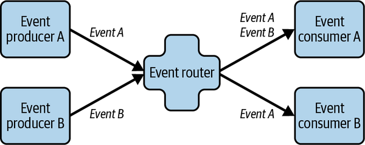

Event-driven architecture comprises four core elements:

- **Events**: Immutable records of something that has happened, carrying metadata (e.g., timestamps, IDs, domain) and data (e.g., order number, amount).
- **Producers**: Systems (web apps, microservices, IoT devices, etc.) that emit events without knowing who will consume them, ensuring loose coupling.
- **Consumers**: Subscribers that receive and process events—either immediately or later—often acting as both publishers and subscribers.
- **Carriers**: Brokers or buses that accept, filter, transform, route, and reliably deliver events, with advanced features like storage, replay, schema registration, retries, dead-letter handling, encryption, and HTTP invocation.

## How relevant to Event Driven Architecture is Serverless?

Most of the managed cloud services from AWS are also event-driven.

## Warning

In an event-driven architecture with multiple event producers and consumers, there is a possibility that consumers may receive duplicate events. It is the responsibility of the consumer to implement the required measures to identify and eliminate the consequences of event duplication. You will learn more about this later in the chapter.


*Figure 3-5. A simple event-driven application where a file upload to an S3 bucket creates an event and invokes a Lambda function*

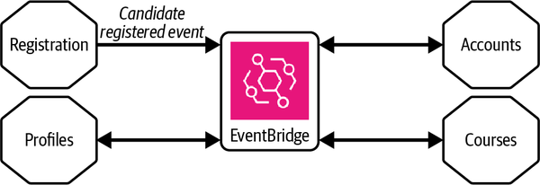

*Figure 3-6. A distributed application where decoupled microservices coordinate via Amazon EventBridge, acting as their event router*

## Client Server Architecture

Initially, **two-tier client/server architecture** was the standard setup: a **server** provided data, while a **client** displayed a graphical interface (GUI) and handled basic data input and validation. Over time, client applications took on more functionality, leading to the development of a **presentation tier**.

- **Two-tier model**: Client manages both the presentation and application layers, connecting directly to a database server.
- **Challenge**: Business logic became intertwined between tiers, making updates complex.
-

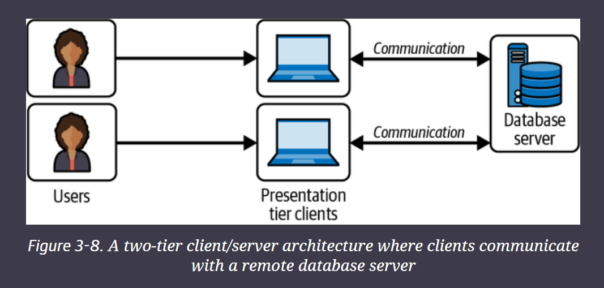

## Rise of Three-Tier Client/Server Architecture

To better separate responsibilities, the **three-tier architecture** emerged, adding an **application tier** between the client and the database.

- **Three distinct tiers**:
  - **Presentation Tier**: User interface
  - **Application Tier** (Middle Tier): Business logic
  - **Data Tier**: Database management

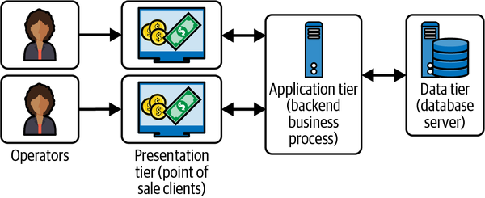

- **Key improvements**:
  - Prevented direct data manipulation by clients
  - Enabled thin clients (lower client-side processing needs)
  - Allowed multiple client types (desktop, web) to access business logic uniformly
- **Supporting technologies**: CORBA, COM, DCOM, EJB — introduced interfaces for standardized communication between tiers.

---

## Relevance to Serverless Architecture

Even though technology evolved, **client/server concepts** strongly echo in **serverless computing**:

- **Distributed applications**: Serverless builds upon the long-standing principle of running applications across different environments.
- **Communication through interfaces**: Serverless relies heavily on APIs, mirroring earlier client/server interface methods.
- **Modularization**: Although older modules were often monolithic and tightly coupled, serverless emphasizes modular, independent, loosely coupled services.

**Takeaway**: If you know client/server principles, you can transition to serverless with a mindset shift toward extreme distribution, flexibility, and abstraction.

---

## Layered vs. Tiered Architectures

While often used interchangeably, **layers** and **tiers** focus on different aspects:

- **Layered architecture**: Logical separation of system components (what functions where).

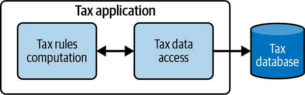

- **Tiered architecture**: Physical separation of system parts (where components run).

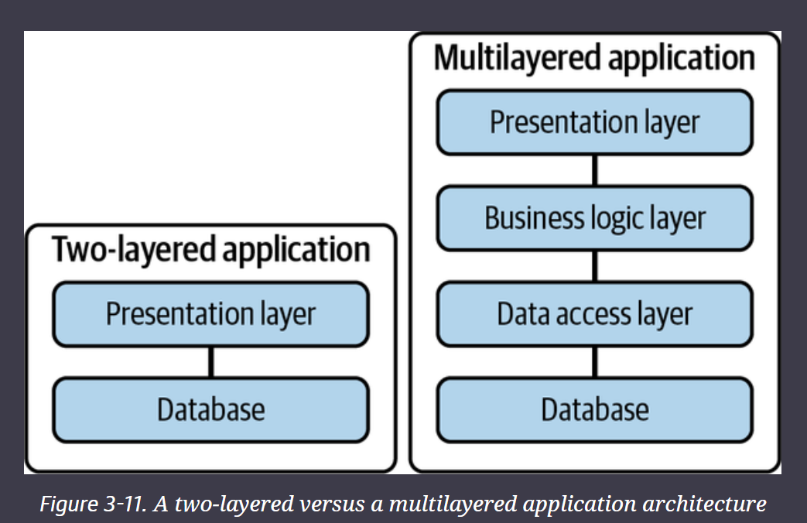

**Examples**:

- Two-tier model: Presentation and data physically separated.
- Multi-layer model: Application logic broken down into many logical layers.

**Benefits of layered architecture**:

- Clear separation of concerns
- Easier code reuse and testing
- Risk: Over-layering can cause "lasagna architecture" (too many thin, entangled layers).

**Benefits of tiered architecture**:

- Modular, scalable, physically distinct components
- Clear interfacing between parts

---

## Serverless Alignment with Layered and Tiered Models

- **Physical tiering** is abstracted in serverless — you no longer manage physical servers, but distribution across cloud services still matters.
- **Logical layering** remains important — visualizing functions and services in modular, manageable units.
- **Deployment flexibility**: In cloud serverless models (e.g., AWS), applications can be spread across accounts and regions for security, scalability, and resilience.

**Visualization**:

- Serverless architecture often mirrors a multi-layered system where services are distributed but logically grouped by functionality.

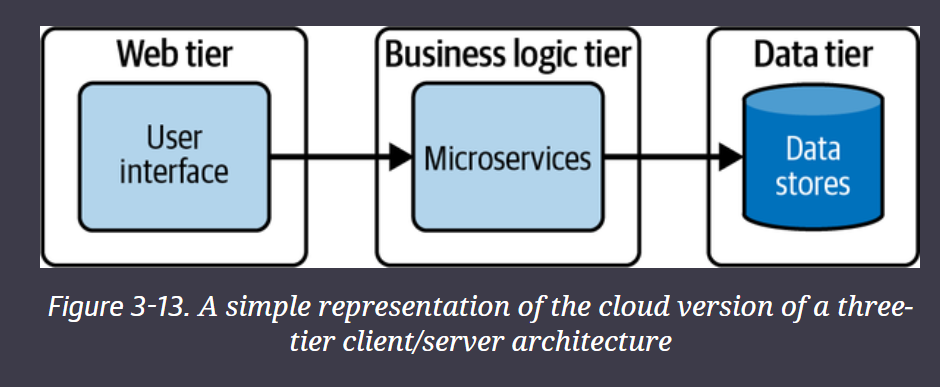

## Hexagonal Architecture (Ports and Adapters)

**Dr. Alistair Cockburn** introduced **hexagonal architecture** to solve tight coupling problems in layered designs. Traditional hard dependencies between components limited flexibility, so this pattern encourages **loose coupling**, letting applications be driven by users, programs, tests, or scripts — independently of databases or devices.

- **Core Idea**: Decouple service components from consumers and providers to increase flexibility and testability.
- **Nickname**: Also called the **Ports and Adapters** pattern.

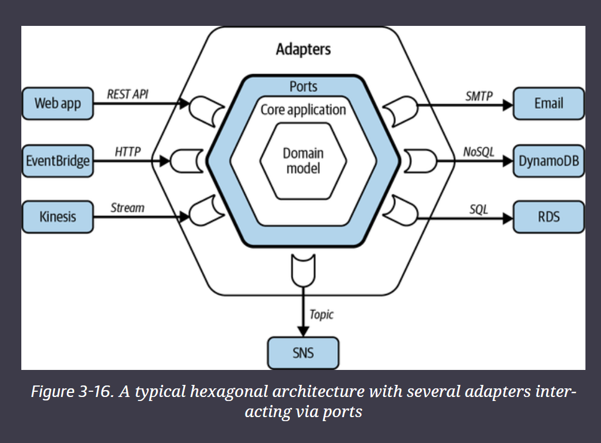

## Core Components

- **Core Application (Service)**:
  - Contains business logic and domain entities.
  - Represents the pure "heart" of the service (e.g., a microservice).
- **Ports**:
  - Interfaces through which the core interacts with external systems.
  - Can represent APIs, database protocols, message queues, etc.
- **Adapters**:
  - Implementations that connect external systems to ports.
  - Examples: HTTP adapters, REST API adapters, NoSQL adapters, event bus connectors, legacy CRM connectors.

> Note: The hexagon shape simply allows room to represent multiple interfaces — it doesn’t imply exactly six connections.
>

## Warning

Hexagonal architecture has its place when you have a heavy core domain shared by several applications and teams across the organization that use different technologies. For most smaller teams that own and operate single-purpose services within a bounded context, assess the need and the overhead before employing full-scale implementation of ports and adapters.

---

## Hexagonal Architecture's Fit for Serverless

Hexagonal principles apply to serverless but must be used thoughtfully:

- **Port Concepts**: Still very relevant. APIs and service endpoints in serverless naturally act like ports.
- **Adapters**:
  - Sometimes needed, especially when integrating with legacy systems.
  - Not always necessary when serverless services already offer managed integrations (e.g., AWS Lambda + API Gateway).
- **Testing with Adapters**:
  - You might use adapters for isolated testing.
  - However, in small, tightly scoped serverless microservices, full hexagonal setups can add unnecessary complexity.

**Caution**: Full-blown hexagonal architecture is better suited for:

- Large, complex domains
- Shared core services across many teams
- Systems needing multiple different external integrations

For **small serverless teams** managing **single-purpose services**, evaluate carefully — the extra abstraction might outweigh the benefits.

## Onion, Clean, and MACH Architectures

In the world of software design, **multiple architectural patterns** exist to promote better separation of concerns, flexibility, and scalability. While the book doesn't deep-dive into each from a **serverless** perspective, understanding them helps recognize patterns you might encounter or adopt.

---

## Onion Architecture

**Created by Jeffrey Palermo**, Onion Architecture is based on the principle of **Inversion of Control** and object-oriented programming practices.

- **Core**: Represents the domain model and business logic.
- **Layers**: Multiple outer layers handle different concerns (e.g., infrastructure, presentation) and **depend inward** toward the core.
- **Key rule**: Inner layers are isolated and unaware of outer ones.

**Relevance**: Focuses on protecting the business logic from external changes — a concept useful in serverless when maintaining pure domain services.

---

## Clean Architecture

**Introduced by Robert C. Martin ("Uncle Bob")**, Clean Architecture also uses a layered/circular model similar to Onion Architecture.

- **Core**: Contains entities and business rules.
- **Outer circles**: Handle external concerns like databases, frameworks, and UI.
- **Data flow**: Standardized formats passed across layers, ensuring **outer layers cannot influence** the inner core's structure.

**Relevance**: In serverless, designing around clean separation from cloud-specific services ensures portability and long-term flexibility.

---

## MACH Architecture

**MACH** is a modern architectural approach promoting **extreme modularity** and **agility** in enterprise applications. It's an acronym:

- **M**: **Microservices** — Independent, self-contained units communicating through APIs/events.
- **A**: **API-first** — Designing with APIs as primary integration points, essential for serverless interaction between services.
- **C**: **Cloud-native** — Fully leveraging managed cloud services, which is foundational to serverless.
- **H**: **Headless** — Decoupling frontend (UX) from backend services via APIs.

**Relevance**: MACH is naturally aligned with serverless philosophy — emphasizing lightweight, fast-to-deploy, API-driven, scalable cloud applications.

---

## Characteristics of a Microservice

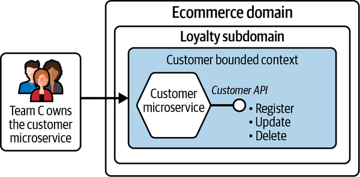

- Is independently deployable
- Represents part of a business domain
- Has a single purpose
- Has a well-defined communication boundary
- Is loosely coupled
- Is observable at a granular level
- Is owned by a single team

- **Independently Deployable**: Each microservice can be deployed without affecting others, enabling parallel team workflows and faster delivery.

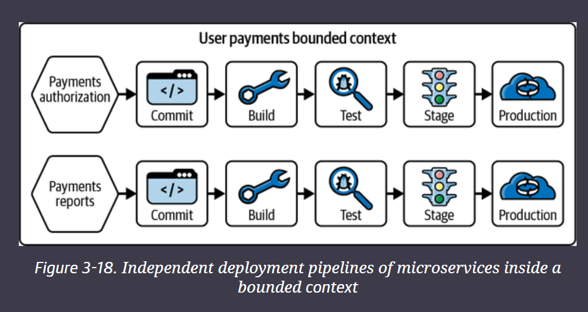

- **Represents Part of a Business Domain**:
  - Each microservice implements a slice of the business logic.
  - Multiple microservices can collaborate within a **bounded context**.

    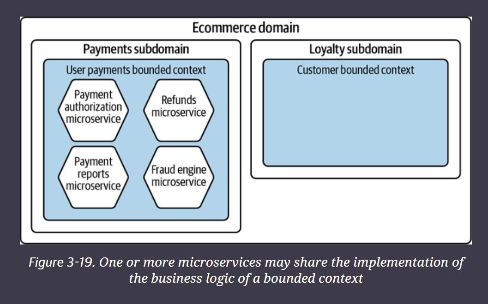

- **Single Purpose (Single-Responsibility Principle)**:
  - Inspired by Robert C. Martin’s SRP: "one reason to change."
  - Each microservice focuses on one business capability.
  - Naming microservices carefully helps reinforce clarity (even playful names like PUPPy can boost team identity).
- **Well-Defined Communication Boundary**:
  - Microservices expose **APIs** or **emit events** for interaction.
  - Clear contracts prevent leaking internal changes externally.
  - Supports decoupling and future-proofing.

    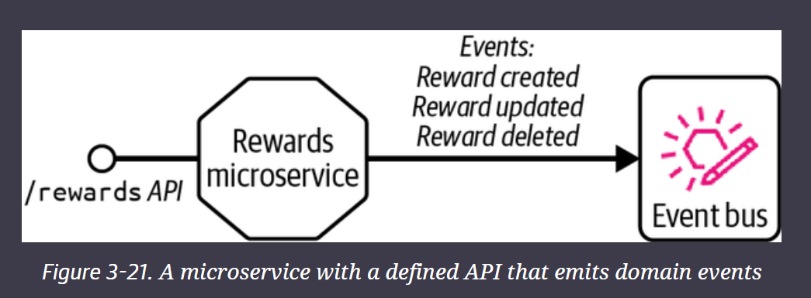

- **Loosely Coupled**:
  - Services interact via standardized APIs or events.
  - Changes in one microservice should not ripple outward.
  - Promotes independent evolution of services.
- **Observable at a Granular Level**:
  - Fine-grained monitoring is essential.
  - Serverless microservices, in particular, allow deep insights via cloud-native observability tools.
- **Owned by a Single Team**:
  - Avoid shared ownership to ensure clear responsibility and minimize friction.
  - Align ownership with business domain-focused teams for smoother collaboration.

## Domain Driven Design and Serverless

**Domain-Driven Design (DDD)**, pioneered by **Eric Evans** in 2003, reshaped how developers think about complex software: by **aligning system architecture with business domains** instead of just technical requirements.

In a **serverless** world, DDD becomes even more vital because the cloud’s flexibility can tempt teams into chaotic, unstructured designs unless they apply strong organizing principles.

---

## Why DDD Matters in Serverless Architecture

- **Clarity Through Bounded Contexts**:
  - In DDD, a **bounded context** defines the boundary around a business concept and the language (ubiquitous language) used within it.
  - In serverless, each bounded context ideally maps to a **set of microservices** or functions — keeping responsibilities clear and avoiding tangled systems.
- **Focusing on Core Domains**:
  - DDD teaches teams to identify the **core domain** — the critical business areas where innovation matters most.
  - Serverless architectures should prioritize investing in the core domain with custom services, while non-core needs (like authentication, billing) can lean on managed cloud services.
- **Encapsulation and Anti-Corruption Layers**:
  - DDD promotes using **Anti-Corruption Layers (ACLs)** to **protect your domain models** from external system influences.
  - In serverless, ACLs can be lightweight functions or microservices that translate external API data into your internal models, avoiding polluting your core logic with external quirks.
- **Resilience to Change**:
  - Bounded contexts and modular design make adapting to changing business needs easier.
  - In serverless, this is critical because cloud services evolve rapidly, and flexibility protects long-term viability.

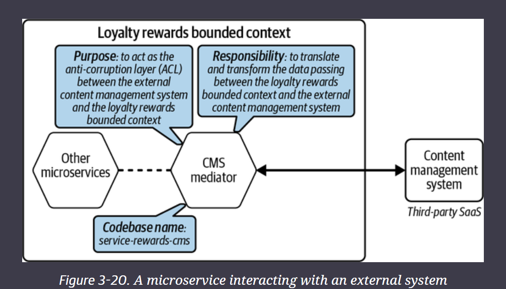

## Microservice Communication Strategies

In a serverless world, **microservices** must still communicate, but **how** they do so matters immensely.

The primary choice is between **synchronous** (request/response) and **asynchronous** (event-driven) communication — and the more you move toward asynchronous, the **looser the coupling** between services becomes.

---

## Synchronous Communication

**Synchronous** means the client sends a request and waits for a response.


It’s common, but creates **stronger coupling** between services and can introduce **latency risks**.

- **Simple Request/Response**:
  - Client (e.g., checkout) calls another service (e.g., payments) and waits.
  - Risks include service timeouts, chained dependencies, degraded UX during slowdowns.

        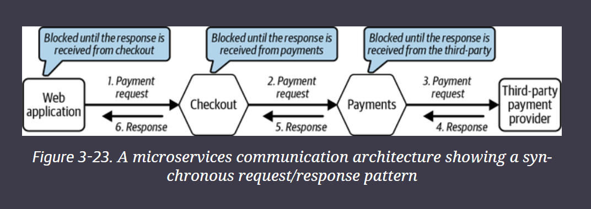

  - Example: Web app waiting on checkout → payments → third-party provider call chain.
- **Request with Acknowledgment (202 Accepted)**:
  - Service acknowledges receipt but processes the request **asynchronously**.
  - Client can disconnect immediately.
  - Use Cases:
    - Bulk data processing
    - Batch settlement captures
    - Mass generation of discount codes
    - Delayed processing of uploaded media

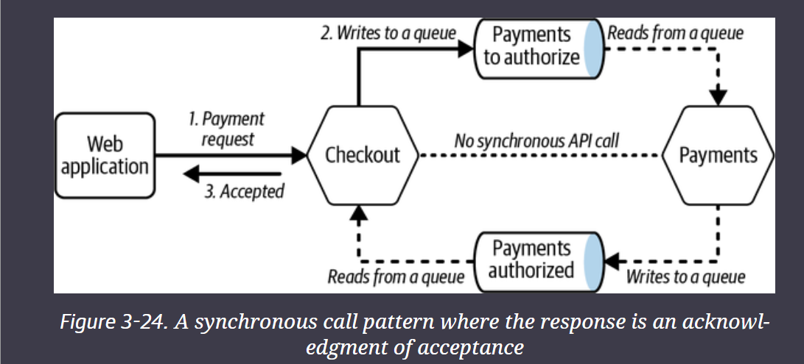

- **Request with Acknowledgment and Client Polling**:
  - Client asks for a status update periodically (/status endpoint).
  - Disadvantages:
    - Requires repeated polling logic
    - Adds operational complexity and extra costs
    - Delays in user feedback

    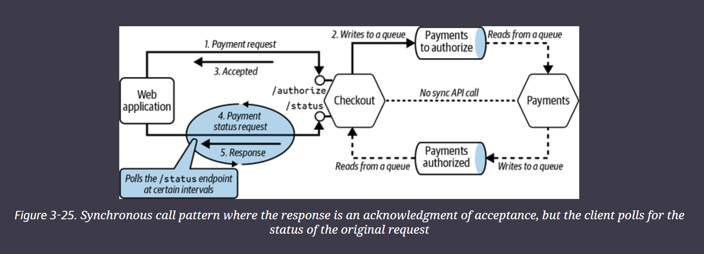

- **Synchronous Request/Response with Async Webhook Notification**:
  - Instead of polling, the service pushes status updates to the client’s webhook endpoint.
  - **More efficient** and **less taxing** than polling.
  - Requires the client to maintain an endpoint to listen for callbacks.

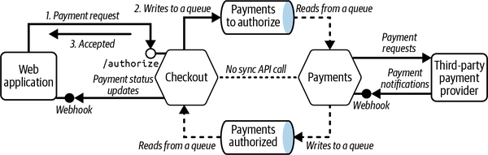

A webhook is a form of user-defined HTTP callback. To receive notifications, the client registers an endpoint URL with the service provider to call back with the information. The client then reacts to the incoming information to trigger further processing. Webhooks are an efficient way of communicating compared to polling.

# Decomposing a monolith into a small pieces via set pieces

- Vision is what you want to achieve in your professional and personal life
- Focus is breaking a task down into smaller bits and executing on the path at a small level
- In Lean Software Development, Mary and Tom Poppendieck introduce the following statement: ***think big; act small; fail fast; learn rapidly***

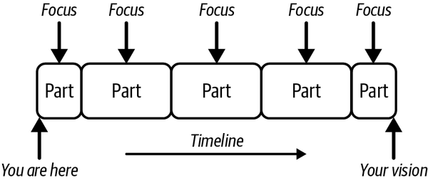

A set piece:  Common in theater, where it refers to a realistic piece of stage scenery built to stand independently as part of a stage set, and in music, to refer to individual parts of a composition that are written, rehearsed, recorded, and then edited together.

A similar concept is applied in team sports, model building, and more. Here are some of the general characteristics of a set piece:

- A set piece is part of a whole thing (the vision).
- When a person or a team works on a set piece, the *focus* is on the piece.
- Every set piece goes through adequate planning.
- Rehearsal, practicing, or testing is essential for a successful set piece.
- Different groups of people can work on different set pieces.
- All the pieces are brought together to make the whole

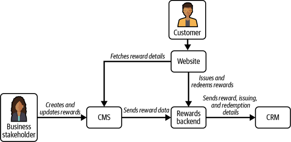

Then applying smaller pieces

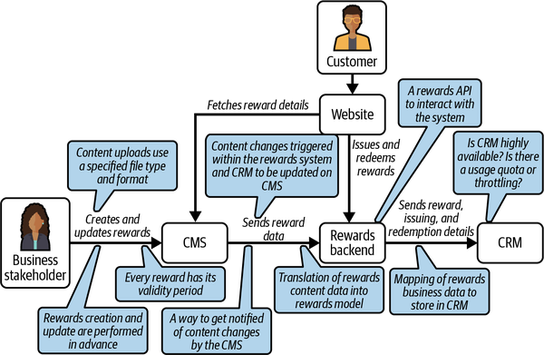

Finally applying various DDD principles and earlier principles in book

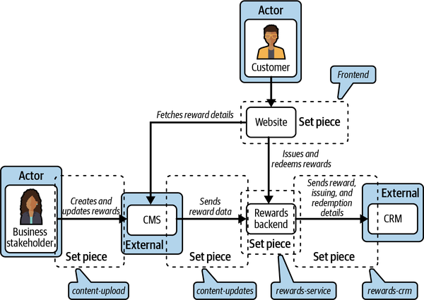

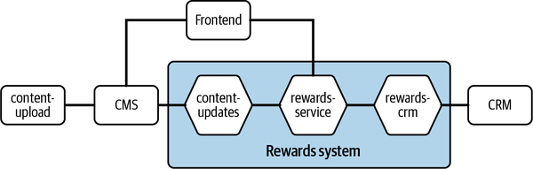

## Bringing it all together

- Leverage as many common patterns as possible to avoid waste in this phase

In serverless, you also have powerful ways to make the set pieces work together. They are:

- APIs, for synchronous request/response communication
- Events, as in the publish/subscribe model in event-driven architecture for asynchronous communication
- Messages, for more direct and decoupled communication between a producer and a consumer

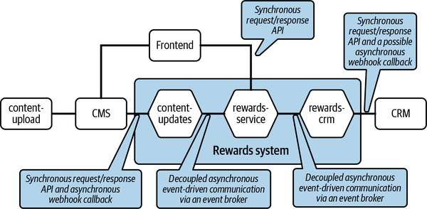

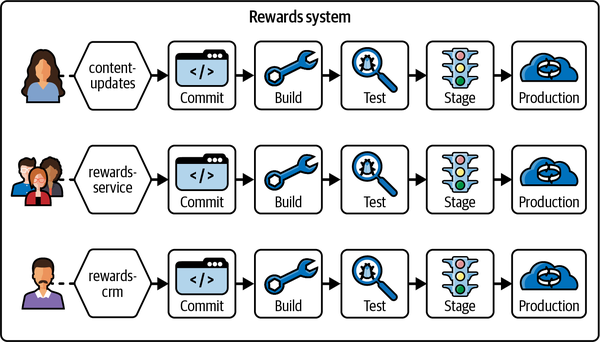

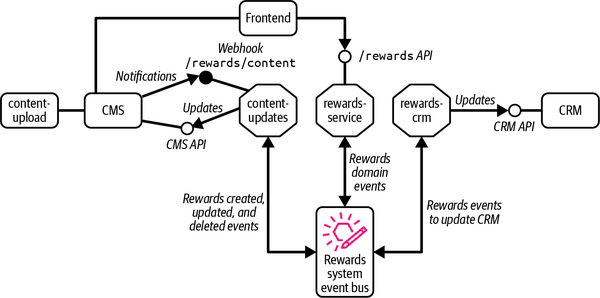

## Breaking a Problem Down Into Pieces

- Using DDD, break your business domain into subdomains and identify the bounded contexts.
- Identify synchronous interactions that require request/response API contracts.
- Isolate business logic that can be performed asynchronously.
- Look for external interactions (for example, with legacy systems, third-party platforms, SaaS applications, data feeds to your corporate data lake, etc.) and assess the need for dedicated microservices to handle them as an ACL implementation.
- Group administrative activities that are specific to the system boundary (API client creation, credential rotation, API usage quota monitoring, etc.).
- Dispatch push notifications from your application to its service consumers.
- Identify common resources and static data, such as size measurements, currency conversions, and country codes, that are accessed by different microservices.
- Think about your observability needs: log streaming, analysis, and filtering activities.
- Determine fraud prevention and intelligence activities that should be part of your business logic (inspecting data, monitoring user activities, etc.).

Microservices:

- You might have microservices that don’t have an API or provide much end user value
- They might just perform batch jobs or handling tracing or a wide variety of tasks

# Event Driven Architecture and Reactive Services

Event-driven architecture is an architectural paradigm that uses events to communicate asynchronously between decoupled microservices.

Event-driven computing is the implementation or realization of event-driven architecture and the behavior of systems that work asynchronously.

4 parts of EDA reminder:

- Event Carrier, Event Producer, Event Carriers, and Events
- (Event routers, Bus, meditator, broker, etc)

A reactive microservice is loosely coupled, resilient and scalable but beyond loose coupling doesn’t show much.


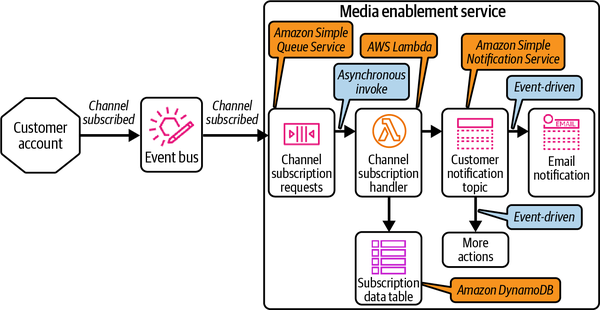

EDA pairs well with serverless as they complement serverless in that they enable on-demand computing, scale to zero, and pay per use.

## EventBridge

Amazon EventBridge is a serverless event bus for building event-driven applications. It ingests events from various producers, filters them, performs optional data transformation, and routes them to one or more target services.

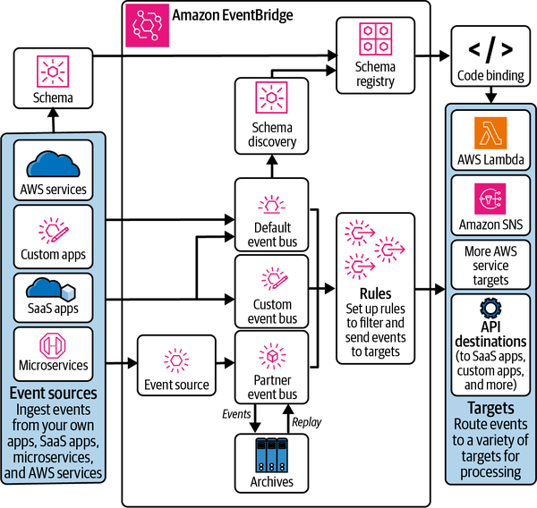

## Core Functionality

- **Event Buses**: These are channels for event flow. Your AWS account has a default event bus for AWS service events, and you can create custom buses for your applications or partner buses for third-party integrations.
- **Event Routing Rules**: Rules define the logic for filtering and routing events on a bus. A rule consists of an **event filter pattern** to match specific events, an optional **data transformation** step, and one or more **targets** (up to five) to send the event to. EventBridge guarantees **at-least-once delivery**, meaning targets might receive duplicate events.

```json
{
  "detail": {
    "metadata": {
      "domain": [
        "ecommerce"
      ],
      "service": [
        "service-payments"
      ],
      "type": [
        "payment_received"
      ]
    },
    "data": {
      "payment_type": [
        "creditcard"
      ]
    }
  }
}
```

## Auxiliary Features

- **Event Archiving and Replay**: You can archive events based on a filter pattern. Later, you can replay these archived events back onto the original event bus for a specific time window. Replayed events contain a `replay-name` attribute to distinguish them from original events.

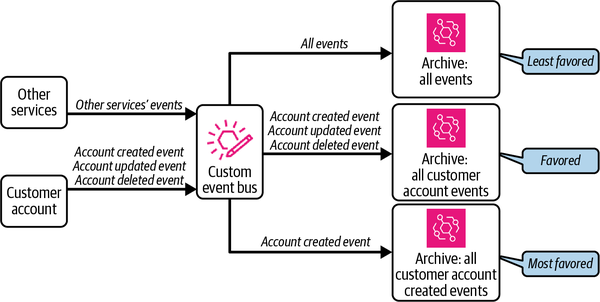

- **Event Schema Registry**: EventBridge can automatically discover the structure (schema) of events. It provides a schema registry to store and manage these schemas. You can also upload custom schemas and generate code bindings to validate events and prevent breaking changes for consumers.
- **EventBridge Scheduler**: This feature allows you to schedule millions of one-time or recurring tasks to invoke over 270 AWS services. It's a fully managed, serverless scheduler with built-in retry mechanisms.
- **EventBridge Pipes**: Pipes create a point-to-point integration between a single event producer and a single consumer. Within a pipe, you can filter, transform, and enrich event data, often reducing the need for custom integration code.

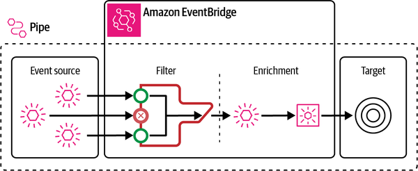

## Domain Events, Event Categories and Types

``

In EventBridge, an event is a data capsule, represented as a JSON object, notifying that something has happened. Event producers publish these notifications, and event consumers subscribe to them.

## Event Structure

Defining a standard event structure is crucial for portability. The structure used here follows the Amazon EventBridge pattern, which includes several top-level attributes.

When sending a custom event, three fields are mandatory:

- **`detail-type`**: A string describing the event's type.
- **`source`**: A string identifying the event's origin.
- **`detail`**: A JSON object containing the specific event payload.

The `detail` field is user-specific. It's a best practice to structure it with common, high-level sections that every team can follow, such as `metadata` and `data`.

The `metadata` section can include common data items often used for routing and filtering rules.

**Example 3-4. Event `metadata` section carrying the domain and service details**

JSON

```json
{
  "metadata": {
    "domain": "ecommerce",
    "subdomain": "orders",
    "service": "payments",
    "category": "domain_event",
    "type": "data",
    "name": "payment_received"
  }
}
```

This can be extended to include critical operational details like tracing IDs or a Time-to-Live (TTL) value to propagate data retention policies.

**Example 3-5. Event `metadata` section carrying domain and operational details**

JSON

```json
{
  "metadata": {
    "version": "2.0",
    "trace_id": "skdj834sd3-j3ns-cmass23",
    "created_at": "2023-12-12T11:24:38Z",
    "domain": {
      "name": "ecommerce",
      "subdomain": "orders",
      "service": "payments",
      "category": "domain_event",
      "type": "data",
      "event": "payment_received"
    },
    "TTL": 1730419200
  }
}
```

The `data` section contains the specific details of the event instance, like customer order information.

**Example 3-6. Event data specific to the customer order**

JSON

```json
{
  "data": {
    "customer_id": "730e-4dfb-9166",
    "order_number": "123-987-456",
    "payment_reference": "cc-visa-9076-cv3s5s",
    "payment_type": "creditcard",
    "amount": 35.99,
    "currency": "GBP",
    "paid_at": "2023-12-30T09:12:27Z"
  }
}
```

## Event Categories and Types

Events can be logically separated into **categories** based on their origin and ownership. Common categories include: Domain, Operational, AWS, Internal, Local, Transformed, and Custom events.

The **type** of an event reflects its purpose and can be explicitly defined within the `metadata`. Common types include:

- **Command**: An instruction for a subscriber to perform an action.
- **Data**: A "publish-and-forget" informational event.
- **Query**: A request for data from the publisher.
- **Request**: A request for consumers to fulfill a service.
- **Response**: An event emitted in reply to a `Request`.
- **Status**: An informational event about the status of an activity.
- **Task**: An event used to coordinate tasks in a larger workflow.

## Domain Events

A domain event represents a significant business occurrence, like a payment being received. These events represent business data valid across the organization and are often named in the past tense (e.g., `payment_received`).

**Example 3-7. A domain event providing information about the receipt of a credit card payment**

JSON

```json
{
  "detail": {
    "metadata": {
      "version": "1.0",
      "created_at": "2023-12-30T09:12:27Z",
      "trace_id": "skdj834sd3-j3ns-cmass23",
      "domain": "ecommerce",
      "subdomain": "orders",
      "service": "payments",
      "category": "domain_event",
      "type": "data",
      "name": "payment_received"
    },
    "data": {
      "customer_id": "730e-4dfb-9166",
      "order_number": "123-987-456",
      "payment_reference": "cc-visa-9076-cv3s5s",
      "payment_type": "creditcard",
      "amount": 35.99,
      "currency": "GBP",
      "paid_at": "2023-12-30T09:12:27Z"
    }
  }
}
```

## Operational Events

These events convey the operational health of a system, such as API latency or service uptime. They help separate business functionality from system behavior and usually stay within a team's boundary.

**Example 3-8. A sample operational event**

JSON

```json
{
  "metadata": {
    "version": "1.0",
    "created_at": "2023-12-20T02:22:27Z",
    "trace_id": "skdj834sd3-j3ns-cmass23",
    "domain": "holiday-travel",
    "subdomain": "flight-booking",
    "service": "service-status-checker",
    "category": "operational_event",
    "type": "status",
    "status": "down"
  },
  "data": {
    "system": "anytime-payment-provider",
    "current_status": "down",
    "previous_status": "up",
    "status_count": "2",
    "checked_at": "2023-12-20T02:15:00Z"
  }
}
```

## AWS Events

These are events owned and produced by AWS services, such as an S3 file upload notification. Your serverless applications will frequently interact with and be driven by these events.

**Example 3-9. A sample Amazon S3 event**

JSON

```json
{
  "Records": [
    {
      "eventVersion": "2.0",
      "eventSource": "aws:s3",
      "awsRegion": "eu-west-1",
      "eventTime": "2023-12-01T00:00:00.000Z",
      "eventName": "ObjectCreated:Put",
      "userIdentity": { "principalId": "EXAMPLE" },
      "s3": {
        "bucket": {
          "name": "festival-promotions",
          "arn": "arn:aws:s3:::festival-promotions"
        },
        "object": {
          "key": "discount_codes.csv",
          "size": 1024
        }
      }
    }
  ]
}
```

## Internal Events

Also called local events, these are vital for driving loosely coupled microservices within a single bounded context but are never shared outside of it.

**Example 3-10. A sample internal event**

```json
{
  "detail": {
    "metadata": {
      "version": "1.0",
      "created_at": "2023-12-30T09:12:27Z",
      "trace_id": "skdj834sd3-j3ns-cmass23",
      "domain": "rewards",
      "service": "third-party-CRM",
      "category": "internal_event",
      "type": "status",
      "status": "retry"
    },
    "data": {
      "customer_id": "730e-4dfb-9166",
      "info": {
        "activity": "reward_update",
        "code": 500,
        "cause": "Internal Server Error"
      }
    }
  }
}
```

## Transformed Events

In EventBridge, you can modify source events before sending them to targets. This is useful for removing sensitive data, simplifying the payload for a specific consumer, or hiding implementation details.

## Differentiating Events and Messages

While often used interchangeably

**Message** is typically directed at a specific receiver with an expectation of processing.

E**vent** is a broadcast notification of a past occurrence to any interested subscribers.

 In practice, the line has blurred with the adoption of event-driven architectures.

## Best Practices

## Event Producers

- **Be Agnostic of Consumers**: This is the golden rule of EDA.
  - > **NOTE:** Well publish and forget there are situations well still loosely coupled within reason, a publisher may want to know the outcome of the handling of an event by a downstream customer (Order status, recordkeeping)
- **Identify Origin**: Clearly identify the event's source (domain, service) in the payload.
- **Use Schema Contracts**: Treat domain events as data contracts that conform to a defined schema. Version events to avoid breaking changes.
- **Carry Minimal Data**: Include just enough data to denote the event's occurrence.
- **Add Trace IDs**: Include a unique tracing identifier for observability.
- **Mind Service Limits**: Be aware of payload size limits (e.g., 256 KB for EventBridge) and publishing quotas.

## Event Consumers

- **Be Idempotent**: Event delivery is guaranteed "at least once," so consumers must be able to handle duplicate events without adverse effects. Don’t bill a customer twice!
- **Store Events First**: Storing an event before processing (storage-first pattern) can help with deduplication and retries. Helps wth Idempotentence and eases retry burdens.
- **Don't Assume Order**: EventBridge does not guarantee order. If order is critical, use sequence numbers from the producer.
- **Don't Modify and Relay**: When relaying an event, emit a new event with a new identity, rather than modifying the original. EVENTS ARE IMMUTABLE!
- **Handle Failures**: Use Dead Letter Queues (DLQs) to collect events that fail delivery after retries. EB will retry for up to 24 hours. Use archive for EB
- Use CloudEvents or AsyncAPI both are similar to OpenAPI specs for REST API’s to define contracts and API’s.

## Event Sourcing

Event sourcing is an architectural pattern where all changes to an application state are stored as a sequence of immutable events. Instead of just storing the current state of data, you persist the full history of events that led to that state. This is useful for:

- Re-creating user session activities or entity states so the system can retrace the steps
- Enabling detailed audit tracing, especially where sensitive data cannot be logged.
- Performing deep data analysis to gain business insights.

Implementing event sourcing requires careful planning around which events to store, where to store them (per microservice, per bounded context, or centrally), and how to manage data access and retention.

NOTE
Since the conception of event sourcing a couple of decades ago, due to the emergence of the cloud and managed services, there have been vast changes in the volume of data captured and the available ingestion mechanisms and storage options. The data models of many (but not all) modern applications accommodate storing the change history for a certain period alongside the actual data, as per the business requirements, to enable quickly tracing all the activities.

## Architectural Considerations for Event Sourcing

Implementing event sourcing requires careful planning, especially in a distributed microservices environment. Key decisions involve identifying which events to store, how to collect them, where to store them (the scope of the event store), how to handle sensitive data, and for how long to retain events.

Several architectural options exist for the scope of an event store:

- **Dedicated Microservice:** A single-purpose microservice can be created to handle all event sourcing concerns, including ingesting events, managing the store, and applying data retention policies.
- **Event Store per Bounded Context:** Each well-defined business area (bounded context) can have its own event store. This is useful for auditing and reconstructing the state of entities within that specific context.

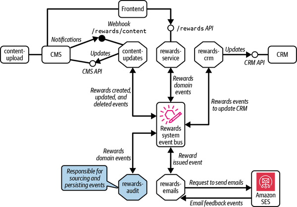

- **Application-Level Event Store:** For complex applications like e-commerce, where a user's journey touches multiple bounded contexts (stock, cart, payments), an application-level store is needed to collate all related events and reconstruct the end-to-end flow.

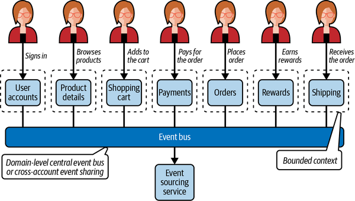

- **Centralized Event Sourcing Cloud Account:** This enterprise-level approach consolidates events from multiple accounts and regions into a single, central repository for security audits, compliance, and business analysis. However, it presents significant challenges in standardizing event sharing, identifying and sourcing all necessary events, structuring the store, and managing data access securely.

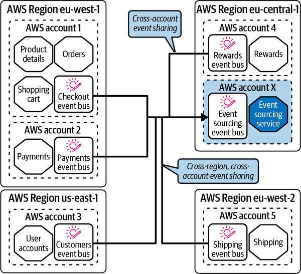

While not every application needs to reconstruct state from events, all teams can benefit from an event store for auditing and tracing critical business flows.

## EventStorming

EventStorming is a collaborative workshop that brings together business and technical experts to model a business process. It uses the language of **domain events**—significant business facts—to create a shared understanding of a complex domain. By arranging these events on a timeline, participants can identify actors, commands (triggers for events), and the boundaries between different business contexts.

In serverless development, EventStorming is valuable for aligning the engineering team with business needs before designing a solution. It is often applied in two stages:

1. **Domain-Level EventStorming:** A "Big Picture" workshop to map out the entire business domain, identify major processes, and define bounded contexts.
2. **Development-Level EventStorming:** A more focused, smaller-scale session within a single team or bounded context to detail internal workflows, local events, and the design of specific microservices and their interactions. Here, the focus is on the bounded context and developments within it. The team identifies the internal process flows, local events, and separation of functionality and responsibilities. These become the early sketches for set-piece microservices, their interfaces, and event interactions. The outcome from the development-level EventStorming feeds into the solution design process

##
