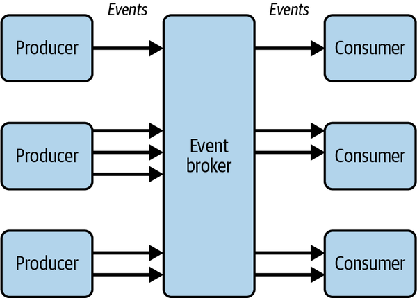

# 4. Security Summed Up

We need to shift left on security and be part of our considerations the moment we are considering ideas for software.


Serverless provides even different security requirements.

## 1. The Paradox of Managed Services

Serverless is built on a foundation of managed services. This is a core strength, allowing teams to offload operational burdens and focus on business logic. However, this reliance introduces a significant challenge: **complexity at scale.** For every single service you consider, you must be able to answer critical questions:

- **Permissions:** How does AWS IAM work for this service? What specific actions are available?
- **Shared Responsibility:** Where exactly does AWS's responsibility end and yours begin for this service?
- **Access Control:** How do you configure network access, resource policies, and private connectivity?
- **Encryption:** How is data encrypted at rest and in transit, and what configuration options do you control?

## 2. The Double-Edged Sword of Configurability

A primary benefit of serverless is **granularity**. You have fine-grained control over the configuration of every function, queue, and database table, allowing for precise optimization of performance and cost.

From a security perspective, however, this granularity is a double-edged sword. Each configuration knob, dial, and option dramatically increases the potential for error. This creates a **vast surface area for the inadvertent introduction of flaws**, such as:

- Excessive permissions on a Lambda function's execution role.
- An incorrectly configured S3 bucket policy.
- A public API Gateway endpoint that should have been private.
- Privilege escalation paths created by complex service-to-service interactions.

## 3. The Unrelenting Pace of Change

The cloud-native ecosystem is defined by its rapid and constant evolution. Staying current is one of the biggest operational challenges for any team. This challenge unfolds on two fronts:

- **Constant Platform Evolution:** AWS delivers new services, features, and improvements at an astonishing rate. These updates can enhance security, but they can also present new attack vectors that must be analyzed and secured. There are always new levers to pull and more things to configure.
- **Evolving Community & Threat Landscape:** The serverless community constantly produces new best practices through blog posts, tutorials, and conference talks. Simultaneously, cybersecurity professionals are in a perpetual race against adversaries, leading to a steady stream of vulnerability disclosures and new security advice.

Keeping up with this flood of information can easily become a full-time job.

## A New Opportunity for Security

While these challenges are significant, they are not insurmountable. The very nature of serverless architecture—with its ephemeral compute, clear resource boundaries, and reliance on explicit permissions—provides a powerful and unique framework for building highly secure applications.

You have a chance to redefine your relationship with application security. By leveraging the inherent benefits of the architecture, security can become simpler, more integrated, and more effective than ever before.

Now, let’s explore how to begin securing your serverless application within this new framework.

## The Core Principles of Modern Serverless Security

To build secure and resilient serverless applications, we must move beyond outdated security models. Your strategy should be built upon two foundational, modern cybersecurity principles: **Zero Trust Architecture** and the **Principle of Least Privilege**. Let's explore how these concepts form the bedrock of a robust serverless security posture.

---

## Principle #1 Zero Trust — Trust Nothing, Verify Everything

The fundamental premise of a Zero Trust security model is to **assume every connection to your system is a potential threat until proven otherwise.**

Under this model, every single interface is protected by a layer of authentication (*who are you?*) and authorization (*what are you allowed to do?*). This applies not only to public-facing APIs but also to every internal, private interface between your resources, such as one Lambda function calling another or a function accessing a DynamoDB table.

## The Castle-and-Moat vs. Zero Trust Analogy

To understand the power of Zero Trust, consider the traditional "castle-and-moat" security model:

> A knight gallops up to the castle walls, presents convincing credentials to the guards, and enters across the lowered drawbridge. If the perimeter guards are the extent of the castle's security, this knight is now free to roam the rooms, dungeons, and jewel store, stealing assets or gathering intelligence for future raids.
>

Now, consider the Zero Trust approach:

> If, however, every individual door, hallway, and treasure chest inside the castle had its own suspicious guard demanding unique credentials, the knight's infiltration would be stopped at the first door. They would be entirely restricted, and the castle would be secure. A single compromised key would not unlock the entire kingdom; it would only unlock a single room.
>

This is the core difference: a castle-and-moat model only defends the perimeter, while a **Zero Trust model places a secure perimeter around every single resource.**

## Why Serverless is the Perfect Architecture for Zero Trust

You cannot simply apply Zero Trust to any application. A monolithic application where the API, business logic, and database all run in a single process is incredibly difficult to secure with granular, resource-based permissions.

**Serverless provides the optimal architecture for Zero Trust.** Resources are naturally isolated across API (API Gateway), compute (Lambda), and storage (DynamoDB, S3). Each of these distinct resources can, and should, have its own highly granular access control, making the Zero Trust model a natural fit.

---

## Principle #2 The Principle of Least Privilege — Grant Only What's Needed

If Zero Trust requires a security perimeter around every resource, you need a powerful authorization layer to define what happens within those perimeters. This is where the **Principle of Least Privilege** comes in.

This principle dictates that as your application resources interact with each other, they must be granted only the **minimum permissions required to complete their specific operations.**

## Practical Scenario Securing a DynamoDB Table

Imagine you have a DynamoDB table and two Lambda functions: one must read items, and the other must write items.

**The Anti-Pattern: Overly-Permissive, Shared Permissions**

You might be tempted to create a single, "full access" policy and share it between both functions. This is a common but dangerous mistake.

JSON

`{
  "Version": "2012-10-17",
  "Statement": [
    {
      "Sid": "FullAccessToTable",
      "Effect": "Allow",
      "Action": ["dynamodb:*"],  // This wildcard is overly permissive
      "Resource": "arn:aws:dynamodb:eu-west-2:account-id:table/TableName"
    }
  ]
}`

This policy violates the principle of least privilege. The read-only function can now write, and the write-only function can now delete the entire table's contents if compromised.

**The Correct Approach: Specific, Least-Privilege Policies**

Instead, you should create two separate, highly-scoped policies.

- **Policy for the Read-Only Lambda:**JSON

    ```json
    {
      "Version": "2012-10-17",
      "Statement": [
        {
          "Sid": "ReadItemsFromTable",
          "Effect": "Allow",
          "Action": [
            "dynamodb:GetItem",
            "dynamodb:Query",
            "dynamodb:Scan"
          ],
          "Resource": "arn:aws:dynamodb:eu-west-2:account-id:table/TableName"
        }
      ]
    }
    ```

- **Policy for the Write-Only Lambda:**JSON

    ```json
    {
      "Version": "2012-10-17",
      "Statement": [
        {
          "Sid": "WriteItemsToTable",
          "Effect": "Allow",
          "Action": [
            "dynamodb:PutItem",
            "dynamodb:UpdateItem"
          ],
          "Resource": "arn:aws:dynamodb:eu-west-2:account-id:table/TableName"
        }
      ]
    }
    ```

Fortunately, AWS IAM operates on a **deny by default** stance. You must explicitly grant every permission, which naturally encourages a least-privilege approach.

---

## The Tool Mastering AWS Identity and Access Management (IAM)

AWS IAM is the service that brings these security principles to life. Its power lies in two core components: **Roles** and **Policies**.

- **Policies:** JSON documents that explicitly define permissions (actions, resources, and conditions).
- **Roles:** Collections of one or more policies that can be "assumed" by a resource (like a Lambda function), granting it temporary permissions.

## Anatomy of an IAM Policy Statement

Every policy is composed of statements with these key elements:

| Element | Description |
| --- | --- |
| **Sid** | (Statement ID) An optional, human-readable identifier for the statement. |
| **Effect** | `Allow` or `Deny`. An explicit `Deny` always overrides an `Allow`. |
| **Action** | The specific AWS API action(s) being permitted or denied (e.g., `s3:GetObject`). |
| **Resource** | The Amazon Resource Name (ARN) of the specific resource(s) the statement applies to. |
| **Condition** | (Optional) Conditions under which the policy is in effect (e.g., allow only from a specific IP address). |

---

## Putting It All Together IAM Guardrails for Serverless

Effective serverless security is about establishing excellent hygiene. Use these IAM guardrails as the core of your secure engineering practices.

- **Guardrail #1: Enforce Least Privilege, Abolish Wildcards.**
Never use wildcards (*) in your policy statements unless an action explicitly requires it. Be specific with every action and every resource.
- **Guardrail #2: Avoid AWS Managed Policies for Application Roles.**
While convenient for prototyping, AWS-managed policies (e.g., `AdministratorAccess`) are too broad for application resources. Always replace them with your own custom, least-privilege policies.
- **Guardrail #3: Prefer Roles, Not Users.**
IAM Users have static, long-lived credentials, which are a security risk. Use roles to grant temporary, short-lived permissions to your resources. Limit or eliminate IAM users entirely.
- **Guardrail #4: A Role Per Resource.**
Every resource (Lambda function, EventBridge rule, etc.) should have its own unique, fine-grained role. Do not share roles between resources with different purposes.

---

## Understanding Your Role The Shared Responsibility Model

Finally, it's crucial to understand your place within the AWS Shared Responsibility Model.

- **AWS's Responsibility (Security *OF* the Cloud):**
AWS is responsible for securing the underlying infrastructure: the data centers, hardware, networking, and the managed services themselves (e.g., patching the Lambda runtime).
- **Your Responsibility (Security *IN* the Cloud):**
As a serverless developer, you are responsible for:
  - The security of your own function code and its third-party libraries.
  - The secure configuration of the AWS resources you define.
  - The IAM roles and policies that govern access control in your application.


## Lesson 1 Proactive Security with Threat Modeling

In security, it's not enough to react to problems; you must proactively find weaknesses before an attacker does. **Threat modeling** is a structured process for doing just that—it's the art of thinking like an attacker to systematically analyze your application for vulnerabilities.

## Your Tool The STRIDE Framework

To give this process structure, we use a framework called **STRIDE**. It's a simple acronym that helps you brainstorm potential threats by breaking them down into six distinct categories.

| Acronym | Threat Category | The Question to Ask |
| --- | --- | --- |
| **S** | **Spoofing** | "Can an attacker impersonate a valid user, service, or component?" |
| **T** | **Tampering** | "Can an attacker modify our data in transit, in memory, or in our database?" |
| **R** | **Repudiation** | "Could an attacker perform an action and then deny they did it?" |
| **I** | **Information Disclosure** | "Can an attacker access information they are not authorized to see?" |
| **D** | **Denial of Service** | "Can an attacker crash our service or exhaust its resources, making it unavailable?" |
| **E** | **Elevation of Privilege** | "Can an attacker gain higher permissions than they were originally granted?" |

To make this manageable, you apply these six STRIDE categories to the four core **elements** of your application:

- **External Entities:** Your users or third-party systems.
- **Processes:** Your Lambda functions or other compute resources.
- **Data Stores:** Your DynamoDB tables, S3 buckets, etc.
- **Data Flows:** The network paths between your other elements.

## Your Action Plan A Simple Threat Modeling Process

Securing an application can feel daunting, but the process can be simple. Start small, work as a team, and follow these steps.

**1. Prepare for the Session:**
Before your meeting, gather the necessary information to ensure a productive discussion:

- High-level architecture diagrams
- Data flow diagrams
- Data models and schemas
- Any relevant industry compliance standards

**2. Decompose the System:**
Identify the key elements in your application (the external entities, processes, data stores, and data flows) that could be targets.

**3. Brainstorm Threats (The STRIDE Part):**
For each element you identified, go through the STRIDE acronym and ask the corresponding question. At this stage, **focus only on identifying threats, not solutions.** Your goal is to generate a list of potential vulnerabilities. *A great start is to identify just one threat for each element/threat combination.*

**4. Plan Mitigations:**
For each threat you identified, now you can brainstorm how to fix or reduce the risk. This could include encrypting data, applying stricter access control, or adding better validation.

**5. Assess and Review:**
Finally, assess your proposed mitigations. Do they fully address the threat? Is there any residual risk your team needs to accept or address further?

---

## Lesson 2 Securing Your Serverless Supply Chain

Your application is more than just the code you write. It's also built upon a foundation of open-source packages and dependencies. This "supply chain" is a primary target for attackers.

> According to security company Socket, supply chain attacks rose 700% in the past year. In one notable incident, a maintainer intentionally added malware to his own popular package, which was a dependency of the official AWS SDK.
>

Following the **Shared Responsibility Model**, AWS is responsible for patching the Lambda runtime environment, but **you are 100% responsible for the security of your function code and all the third-party libraries you include.**

## Your First Line of Defense Think Before You Install

The most effective security practice is simple vigilance. Every time you install a dependency, you are implicitly trusting hundreds of contributors.

Before you type `npm install` or `pip install`, follow this checklist:

- **Analyze the GitHub Repository:** Is the project actively maintained? How many contributors are there? Are commits verified? Does the license align with your organization's policies?
- **Use Official Package Repositories:** Only install packages from official sources like NPM, PyPI, or Maven over secure HTTPS links.
- **Review the Dependency Tree:** A package might be trustworthy, but what about its dependencies? And their dependencies? Be aware of the entire tree and prefer packages with zero runtime dependencies where possible.
- **Check If You Can Do It Yourself:** Is the package solving a trivial problem? For simple tasks like a basic logger, consider writing a small, first-party utility to avoid introducing an opaque third-party dependency.
- **Lock to the Latest Version:** Always use the latest stable version of a package and lock it to that explicit version in your manifest file (e.g., `1.2.3`, not `^1.2.0` or `latest`).
- **Uninstall Unused Packages:** Keep your dependencies manifest clean and remove anything you are no longer using.

## Your Ongoing Strategy Automate and Scan

- **Continuously Scan for Vulnerabilities:** Use tools like Snyk or GitHub's Dependabot to automatically scan your repositories for newly discovered vulnerabilities in your dependencies.
- **Automate Dependency Upgrades:** This is the most crucial step. Keeping packages up-to-date ensures you have the latest security patches. Use automated tools to create pull requests for new versions, but always review them to ensure the integrity of the incoming update.
- **Keep Runtimes Up-to-Date:** Ensure your Lambda functions are configured to use the latest supported runtime versions to benefit from security and performance improvements from AWS.

## Advanced Hardening Locking Down Your Deployment

For organizations with a high level of security maturity, you can go even further.

- **SLSA (Supply chain Levels for Software Artifacts):** This is a security framework (pronounced "salsa") that provides a checklist of standards to prevent tampering and improve integrity across your entire software supply chain.
- [**Lambda Code Signing](https://docs.aws.amazon.com/lambda/latest/dg/configuration-codesigning.html):** This is the "last mile" of supply chain security. It allows you to digitally sign your deployment packages. When you deploy, the Lambda service verifies that the code was signed by a trusted source and has not been altered since it was signed.

## Securing API Gateways


Sample Cognito and API Gateway


## Securing Your Front Door — Protecting HTTP APIs

## **Layer 1 Controlling Access with Authorizers**

For **API Gateway HTTP APIs**, you have two primary options for verifying a client's identity before their request is processed.

JSON Web Tokens (JWTs) are an **open standard that defines a compact, self-contained way of securely transmitting information between parties as JSON objects1**. They are used to **ensure the integrity of a message and the authentication of both the message producer and consumer1**. JWTs can also be **cryptographically signed and encrypted**, allowing for the verification of the integrity of claims within the token while keeping those claims hidden from other parties

- **JWT (JSON Web Token) Authorizers:** This is the most efficient, declarative approach. API Gateway itself validates incoming JWTs against a trusted issuer (like Cognito or Okta) and a specific audience. If the token is valid, the request proceeds; if not, it's rejected. No custom code is required.

**Application in AWS API Gateway**

JWTs are a crucial authorization strategy for securing serverless APIs, particularly with AWS API Gateway.

- **JWT Authorizers for HTTP APIs**: If you are using an API Gateway **HTTP API**, **JWT authorizers are a good option if your authorization strategy involves a client submitting a JSON Web Token for verification5**. With a JWT authorizer, the **entire authorization process is managed by the API Gateway service itself5**.

◦ **Configuration**: When configuring a JWT authorizer using CloudFormation, key properties include:

▪ApiId: The ID of the API Gateway**6**.

▪AuthorizerType: Set to JWT**6**.

▪IdentitySource: Specifies **where the JWT is provided by the client in the API request**, for example, the Authorization HTTP header**6**. Any requests without this required property will immediately receive a 401 Unauthorized response, and the authorizer will not be invoked**7**.

▪JwtConfiguration: Corresponds to the expected values within the tokens submitted by clients**6**. This includes:

- Audience: The HTTP address for the recipient of the token, usually your API Gateway domain**6**.
- Issuer: The HTTP address for the service responsible for issuing the tokens, such as **Amazon Cognito** or **Okta56**.

◦ **Lambda Authorizers with JWTs**: While HTTP APIs have native JWT authorizers, **REST APIs can also use JWTs for authorization and authentication, but this requires writing a custom Lambda authorizer that verifies incoming tokens**

## **Tip**

Caching the responses of your Lambda authorizers will result in quicker responses to API requests as well as a reduction in costs, as the Lambda function will be invoked significantly less frequently.


## **Layer 2 Protection and Validation**

Beyond authorization, you must protect your API from abuse and bad data.

- **Denial of Service/Wallet Protection:**
  - **Usage Plans:** You can throttle requests from individual clients by issuing them API keys and setting rate limits (e.g., 10 requests/second) and quotas (e.g., 5,000 requests/day).
  - **AWS WAF (Web Application Firewall):** This provides a powerful firewall at the edge, allowing you to block malicious requests based on IP addresses, geographic location, or patterns indicating common attacks like SQL injection.
- **Request Validation:**
  - You can define a **JSON Schema** for your API routes. API Gateway will validate the structure of incoming requests against this schema *before* invoking your backend Lambda function. If the request is missing a required field or has the wrong data type, it is rejected immediately, saving a function invocation and preventing malformed data from entering your system.


---

## Lesson 2 Securing Internal Messaging — Verifying Event-Driven Architectures

In asynchronous, event-driven systems, the security challenge shifts from authenticating end-users to **verifying messages passed between decoupled services.** In a Zero Trust architecture, a consumer service must always guard against **sender spoofing** and **message tampering**.

## **The Challenge Trust in a Decoupled World**

In a typical event-driven architecture (e.g., using Amazon EventBridge), producers send events without knowing who the consumers are. This creates a security gap: a consumer must be able to trust that a message is authentic and has not been altered.



## **The Solution Verifiable and Encrypted Messages**

A powerful pattern to solve this is using **Nested JSON Web Tokens (JWTs)**.


1. **The Producer's Job: Sign then Encrypt**
    - The service producing the message first **signs** the payload with its **private key**. This creates a verifiable statement of authenticity.
    - It then **encrypts** the *entire signed JWT* with a **shared secret** known only to it and its authorized consumers.
2. **The Consumer's Job: Decrypt then Verify**
    - Upon receiving a message, the consumer first **decrypts** the outer message using the **shared secret**.
    - It then **verifies the signature** of the inner token using the producer's **public key**.
    - If both steps succeed, the message is confirmed to be both authentic (from the correct sender) and integral (unaltered).

> Key Management: All cryptographic keys (public/private key pairs and shared secrets) should be securely stored and managed in a service like AWS Key Management Service (KMS) or AWS Secrets Manager and fetched at runtime. The private key must never be shared.
>

## **Simpler Alternatives Native AWS Integrations**

For less complex needs, some AWS services are beginning to offer this functionality natively. For example, **Amazon SNS** can now digitally sign messages it delivers, allowing subscribers to easily verify their authenticity without a custom cryptographic implementation.

## Other Methods for Improving Security on Web API’s

◦ **Throttling via Usage Plans**: Control the rate of requests from individual API clients to prevent deliberate or inadvertent abuse of your service**35**.

◦ **AWS WAF (Web Application Firewall)**: Provides granular protection by applying a set of rules (e.g., IP address throttling) to incoming requests. WAF rules are applied before other access control mechanisms**36**.

- **Request Validation**: API Gateway can validate incoming request bodies against a JSON Schema definition before invoking downstream functions. This prevents malformed requests from reaching your application logic

# Protecting Data

Protecting data is critical, especially in event-driven serverless systems where information is constantly flowing. This involves two key aspects: encryption in transit and encryption at rest.

Encryption in transit safeguards data as it moves between services. All AWS services, for instance, offer secure and encrypted communication channels using Transport Layer Security (TLS). By default, operations within the AWS environment utilize these secure endpoints, and requests are further protected against tampering and spoofing.

Encryption at rest applies to data that is stored or temporarily cached. This is particularly important for sensitive information held in services such as event archives, message queues, storage buckets, or databases. Typically, this level of encryption can be configured for each specific resource.

A key tool in this process is a managed service for creating and controlling the cryptographic keys used for data protection. Services like AWS Key Management Service (KMS) are integrated with most cloud services, simplifying the management of these essential security components.

- Use a secure vault.
Always use a secure vault to store encryption keys and secrets, like AWS KMS, Secrets Manager, or Systems Manager Parameter Store (with secure strings).
- Never store secrets outside the secure vault.
For example, do not store keys on a local machine or in a code repository. Only fetch keys and secrets at runtime, and do not cache them.
- Ensure keys are protected from unauthorized access.
For example, enforce least privilege in IAM policies that access KMS keys.
- Use independent keys.
When multiple keys are required, use distinct keys rather than sharing keys across services or clients.
- Manage the lifecycle of keys.
Devise a strategy for rotating keys (and algorithms) based on the type of key and its intended purpose. Key rotation can be either manual or automated.

To maintain robust security, it is crucial to establish clear guidelines for managing keys and secrets. These should always be stored in secure vaults, never within code repositories or on local machines. Access to these sensitive assets should be strictly limited based on the principle of least privilege.

In asynchronous, event-driven systems, it is also vital to verify incoming messages at each integration point. This guards against potential sender spoofing and message tampering. A common method for this is the use of JSON Web Tokens (JWTs) for signing and encrypting message content.

V. Continuous Security & a Culture of Responsibility

A proactive approach to security involves continuous threat modeling. This process, which should begin in the early design phases of a system, aims to continually identify potential attack vectors, threats, and corresponding mitigations. Frameworks such as STRIDE—which categorizes threats into Spoofing, Tampering, Repudiation, Information Disclosure, Denial of Service, and Elevation of Privilege—can be valuable in this effort.

It is also important to understand the shared responsibility model inherent in cloud computing. While the cloud provider is responsible for the security *of* the cloud infrastructure itself, the user is responsible for security *in* the cloud. This includes securing their own application code, configuring cloud resources correctly, and managing user access and permissions.

Ultimately, effective security relies on fostering a strong security culture within an organization. This involves promoting transparency, encouraging a "no-blame" environment when issues arise, and committing to continuous learning. Engineers should be empowered to be curious about potential vulnerabilities and given the time and resources to explore and address them. In such a culture, security becomes everyone's responsibility.

Go-Live Security Checklist for Serverless Applications
Here’s a practical list of things to check before launching a serverless application. It can also form part of a security automation pipeline and your team’s security guardrails:

Commission penetration testing and security audits early in your application’s development.

Enable Block Public Access on all S3 buckets.

Enable server-side encryption (SSE) on all S3 buckets containing valuable data.

Enable cross-account backups or object replication on S3 buckets containing business-critical data.

Enable encryption at rest on all SQS queues.

Enable WAF on API Gateway REST APIs with baseline managed rules.

Use TLS version 1.2 or above on API Gateway APIs.

Enable access and execution logs on API Gateway APIs.

Remove sensitive data from Lambda function environment variables.

Store secrets in AWS Secrets Manager.

Encrypt Lambda function environment variables.

Enable Lambda function code signing.

Enable backups on all DynamoDB tables containing business-critical data.

Scan dependencies for vulnerabilities: resolve all critical and high security warnings, and minimize medium and low warnings.

Set up budget alarms in CloudWatch to guard against denial of wallet attacks.

Remove any IAM users where possible.

Remove wildcards from IAM policies wherever possible to preserve least privilege.

Generate an IAM credential report to identify unused roles and users that can be removed.

Enable Security Hub reports.

Create a CloudTrail trail to send logs to S3.

Conduct a Well-Architected Framework review with a focus on the Security pillar and the Serverless Lens’s security recommendations.
