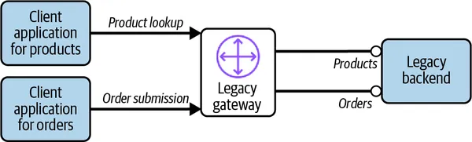
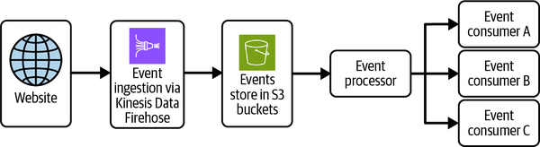
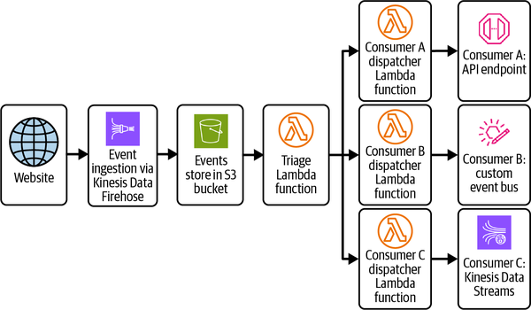
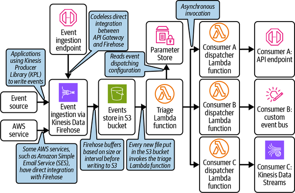

# 5. Serverless Implementation Patterns

.png)

In its simplest form, a pattern is a **proven solution to a recurring problem2**. When applied to software design, a pattern assists designers in achieving the correct software design more quickly, while an implementation pattern helps developers build applications rapidly**2**. Most software patterns share several common elements:
**Evolution and Categories of Software Patterns**

The concept of software patterns has a rich history:

- **Foundational Works** No discussion on software patterns is complete without mentioning *Design Patterns: Elements of Reusable Object-Oriented Software* (1994) by the **Gang of Four (GoF)**, which was heavily influenced by Object-Oriented (OO) principles but presented patterns that outlasted popular programming languages of that era.
- **Integration and Microservices** Ten years after the GoF book,
  - *Enterprise Integration Patterns* (2004) by Gregor Hohpe and Bobby Woolf introduced a collection of 65 patterns as web services and enterprise application integrations emerged**5**.
  - Sam Newman's *Building Microservices: Designing Fine-Grained Systems* brought new perspectives to architecting business applications, followed by
  - Chris Richardson's *Microservices Patterns*, which presented over 40 different patterns and their implementation details.
- **Serverless-Specific Collections** Jeremy Daly, an AWS Serverless Hero and CEO of Ampt, published one of the earliest collections of patterns specifically focused on building serverless solutions on AWS in 2018. His updated collection continues to help engineers with serverless adoption.

**Serverless itself can be viewed as a cloud development pattern** that enables building and operating highly scalable cloud solutions rapidly. It is an evolution of cloud computing and is influenced by many existing popular patterns from architecture, design, integration, storage, implementation, and operation**910**. At the same time, serverless also introduces entirely **new patterns**.

Serverless accelerates development by providing out-of-the-box capabilities for common software patterns. For example, AWS services like Amazon SQS and SNS natively support point-to-point messaging and publish/subscribe patterns, reducing the need for hand-coding these functionalities. The challenge often lies in deciding which specific service to use in a given scenario.

New patterns are continually being discovered and applied in serverless development, particularly when experimenting with new technologies and service combinations**6**. Once a design construct proves effective for a specific use case, it can be repeatedly applied in similar situations, potentially evolving into a new pattern.

 These patterns serve as **guides to inspire better serverless solutions**, rather than rigid, universal solutions. They can have several variations and distinct implementation styles, much like snowflakes.

**It remains critical to understand the core fundamentals of the pattern and know when to USE IT AND NOT USE IT.**

.png)

.png)

# Strangler Fig Pattern

It's a pattern for migrating legacy enterprise applications to serverless using an incremental and iterative approach.

The core idea is to shift functionality in small parts from the old application to a modern serverless stack, gradually "strangling" the source system by moving all its pieces to the target.

## Benefits of the Strangler Fig Pattern

This pattern is considered the most reliable migration pattern due to several benefits:

- **Lowering risk:** It reduces the overall risk involved in the migration process.
- **Providing visibility:** It offers visibility into the progress of the migration.
- **Allowing course correction:** It enables adjustments without significant disruption.
- **Reducing service disruptions:** It helps reduce or even avoid service disruptions and system downtime.

## Implementation Approaches

A crucial aspect of applying this pattern is having a clear understanding of the end goal and in-depth knowledge of both the system being migrated and the shape of the migrated system. You can take inspiration from the "set piece" microservices development analogy, identifying parts that can be gradually migrated.

Implementation can occur at different levels:

- **High-level strangler approach:** Focuses on tactical migration of frontends, backends, APIs, data processing jobs, and other high-level components, considering dependencies, business criticality, risks, and compliance.
- **Low-level strangler approach:** Involves taking each system part and progressively moving it to the target serverless architecture.

The sources provide specific examples of applying the pattern:

**1. Strangling Data Processing Flows:**

.png)

- Many organizations have vital data and data processing flows spanning multiple domains.
- A common legacy approach involves data files placed in network folders, fetched by consuming applications at intervals.

.png)

- The migration requires a vision of the target serverless architecture, which might include new serverless microservices alongside existing applications.

.png)

- The goal is to gradually direct data feeds from legacy routes into a common place, like an S3 product feeds bucket.
- An intermediary phase might be needed, for example, rerouting a data feed to a legacy system via an API, before fully switching to a new backend. This improves efficiency by processing feeds as soon as they arrive.

**2. Strangling API Routes to Backend Services:**

- This strategy is similar to data pipeline migration: identify a piece of functionality (often a "low-hanging fruit"), build a replacement in serverless, and gradually shift traffic from the old endpoint to the new one.
- During this transition, both old and new endpoints run in parallel, allowing observation and improvement of the new service before the old one is "strangled".
- Opportunities may arise to rebuild synchronous endpoints as asynchronous services in the target serverless architecture.
- A "switchboard" layer is needed to route incoming requests to the correct backend. API Gateway and Backend for Frontend (BFF) patterns serve as façade layers for this purpose.
  - **API Gateway as the façade layer:** Amazon API Gateway is suitable for AWS cloud migrations, offering service integrations to invoke HTTP endpoints. Initially, the new API Gateway becomes a target for a client application but routes requests to the legacy gateway while the new microservice is developed. Once the new microservice is ready, routing is switched directly to it, and the legacy system is further "strangled". A warning is issued that routing traffic through an extra network route (from new API Gateway to old API Gateway) during migration can add latency.
  -

    

    

## The Backend for Frontend Pattern


In many architectures that serve a variety of clients, a common approach is to provide a single, general-purpose API endpoint. This omnibus API acts as a facade to the underlying system, but it must cater to the needs of every client, from full-featured desktop web browsers to resource-constrained mobile applications. The Backend for Frontend (BFF) pattern offers a different approach. Instead of a single facade, it advocates for creating a separate backend service for each distinct frontend, providing a tailored API that serves as an intermediary between that specific client and the downstream services.

The core idea is to move from a single, shared gateway to multiple, client-specific gateways.

**A General-Purpose Facade:**

`Mobile Client   \
Web Client       ->   Single API Facade -> Downstream Services
Third-Party App  /`

**The BFF Approach:**

`Mobile Client   ->   Mobile BFF   -> Downstream Services
Web Client      ->   Web BFF      -> Downstream Services
Third-Party App  ->   Partner BFF  -> Downstream Services`

## The Rationale for a Backend for Frontend

The driving forces behind adopting this pattern are rooted in addressing the friction that arises when a single API must serve disparate clients.

- **Tailoring the Client Experience:** A mobile application often has fundamentally different needs than a desktop web application. It requires smaller data payloads, simpler data structures, and may have different interaction models. A BFF allows you to craft an API that is precisely optimized for its specific client, filtering out extraneous data and formatting the payload to minimize work on the client side.
- **Decoupling and Team Autonomy:** A significant architectural benefit is the introduction of a seam between client application teams and the teams managing core backend services. The frontend team can take ownership of its BFF, allowing them to iterate on their API and user experience at their own cadence. They are no longer blocked waiting for changes in the general-purpose services, which can evolve independently.
- **Simplifying the Frontend by Shifting Complexity:** The BFF can absorb the responsibility of orchestrating calls to multiple downstream services. Instead of the client making several requests and performing complex data aggregation, it makes a single request to its BFF. The BFF then handles the intricate communication with the backend, effectively simplifying the client-side codebase and keeping it focused on presentation logic.

## Mechanics of the Pattern

A request-response cycle illustrates the mechanics of the BFF. Consider a client application rendering a user's dashboard.

1. **Client Request:** The client makes a single call to an endpoint on its BFF, for instance, `GET /dashboard`.
2. **Orchestration:** The BFF receives this request and, based on the needs of its specific client, orchestrates calls to several downstream services. It might fetch customer data from a `UserService`, recent activity from an `ActivityService`, and account status from an `AccountService`.
3. **Aggregation and Transformation:** As responses arrive from the downstream services, the BFF aggregates the information. It transforms the data into a single, cohesive payload, stripping away any fields irrelevant to the client and ensuring the structure is exactly what the client expects.
4. **Client Response:** The BFF returns this composed, optimized payload to the client, which can then render its view with minimal processing.

## Consequences and Trade-offs

While the BFF pattern offers significant advantages, one must be cognizant of its trade-offs. It is not a universally applicable solution.

- **Risk of Code Duplication:** A primary concern is the duplication of logic across different BFFs. Logic for security, service discovery, or calling the same downstream services may need to be implemented in each BFF. This can be mitigated with shared libraries, but it requires disciplined engineering to manage effectively.
- **Increased Operational Overhead:** The pattern introduces more deployable artifacts into the system. Each BFF is another service that must be built, deployed, monitored, and maintained. This proliferation of services adds to the operational complexity of the system landscape.

Therefore, the BFF pattern is not a default choice but is best applied in specific contexts. It is most appropriate for systems of sufficient complexity, where multiple client types have divergent needs, and the benefits of team autonomy and client optimization outweigh the costs of the increased architectural complexity. For simpler applications with a single client type, a direct connection to a single API facade remains a more pragmatic approach.

# Circuit Breaker Pattern

The circuit breaker pattern is a crucial architectural pattern for building resilient and highly available applications in distributed services environments. Its core concepts are derived from electrical switches that protect circuits from overload or outage.

Here are the core concepts of circuit breaker implementation:

- **A closed circuit:** This signifies that the connection between two systems is working as expected. For instance, in a synchronous request/response invocation, a Lambda function successfully fetching customer order details from a third-party SaaS platform indicates a closed circuit.

.png)

- **An open circuit:** When a circuit is marked as open, the connection between systems is prevented. If the third-party system is down or too slow, the Lambda function will not invoke it but will fail immediately and return an error response.

    .png)

- **The circuit breaker:** This is an object or manager that wraps a protected function call and monitors for errors. It uses defined logic to decide whether to declare a circuit as open or closed. This determination often depends on threshold conditions, such as a certain number of consecutive failures within a specific timeframe. The purpose of the circuit breaker is to fail fast rather than waiting for an unresponsive service, thereby limiting damage.
- **A half-open circuit:** When a circuit is open, the circuit breaker needs a mechanism to determine if it's safe to close the circuit again. Since it cannot know if the external application has recovered, the typical approach is to wait for a duration and then allow a few invocations through. Based on the success or failure of these test calls and its internal logic, the circuit breaker will either mark the circuit as closed or keep it open with a new timeout value for another check. This "half-open" state allows the circuit breaker to "test the waters".

## Relevance in Serverless Environments

The circuit breaker pattern is particularly relevant in serverless for several reasons:

- During peak network traffic, if a serverless microservice invokes an unresponsive remote application, it risks cloud resources quickly reaching allocated quotas or concurrency limits.
- Lambda functions may run longer while waiting for responses, increasing costs.
- A delay in one service can trigger a domino effect, leading to application-wide gridlock.
- Disgruntled users might repeatedly retry requests, further overloading an already crippled service and exhausting resources. Implementing a circuit breaker helps to mitigate these risks by allowing the system to quickly assess the unhealthy status of a service provider and fail fast.

## Implementation Considerations

As the Lambda service does not offer built-in circuit breaking functionality, understanding the pattern and its implementation is important. The exact implementation logic varies based on the use case, but it minimally requires a place to store the current status of the circuit. Additional data like threshold counters, timeout values, and number of attempts may also be stored. Options for storing this information include AWS Systems Manager (SSM) Parameter Store for simple cases or DynamoDB for more complex logic involving counts and timestamps.

.png)

## Failing Faster and Request Handling

A common application of the circuit breaker pattern is to fail fast, returning an error response swiftly when a dependent application cannot fulfill requests within an expected timeframe. This leads to:

- Increased end-user satisfaction by providing quick feedback.
- Lower costs by preventing Lambda functions from running longer while awaiting responses.
- Less risk of overburdening an already stressed system by avoiding repeated retries from users.

For critical services, another common use of the circuit breaker is to store requests when the circuit is open and replay them when it closes. This ensures that important requests, such as holiday reservations or payment processing, are not lost during outages. Various serverless services can be used for this purpose, including:

- **Dedicated SQS queues for storage and replay.** Requests are pushed to the queue when the circuit is open and processed from the queue when it closes.
- Dedicated Event-Driven Status Checking Service. Using a microservice to handle status checks.

.png)

- **DynamoDB to store incoming requests or events,** with a status attribute to indicate whether a request has been processed or needs resubmission (RETRY).
- **EventBridge's event archiving and replay capabilities.** When the circuit is open, a retry event is sent to a custom event bus and routed to an EventBridge archive. When the circuit closes, events are replayed from the archive onto the bus for resubmission.
- This approach offers unlimited storage and eliminates the need for complex fetching logic, though it has limitations
  - Event Ordering isn’t maintained so expect out of order events
  - Replay speed control, and the ability to delete replayed events.
  - There can also be a delay for events to arrive in the archive.

.png)

.png)

# Functionless Integration Pattern

The functionless integration pattern is a concept aimed at reducing the use of Lambda functions in serverless architecture. The core idea is to compose applications using managed cloud services, knitting them together with out-of-the-box features and Infrastructure as Code (IaC) rather than by hand-coding Lambda functions for integration. This pattern embodies the principle that "code is a liability" where applicable, though it acknowledges that applications cannot be built entirely without code.

.png)

.png)

## Purpose and Benefits

The goal of this pattern is to minimize the Lambda footprint wherever suitable. By avoiding the need to write Lambda functions for simple data transport or integration tasks, organizations can achieve several benefits:

- Write, test, deploy, and operate less code.
- Reduce points of failure and debugging hassles.
- Configure fewer IAM policies and permissions, leading to fewer security concerns.
- Lower the danger of exceeding Lambda concurrent execution quotas.
- Decrease the monthly cost associated with Lambda functions.

While the appeal may be less obvious for applications with only a few Lambda functions, the positive impact can be substantial across an entire organization.

## Use Cases and AWS Service Integrations

The functionless integration pattern is applicable in various parts of a serverless architecture, with implementation details depending on the business domain and the AWS services used.

Key AWS services that facilitate this pattern include:

- **Amazon API Gateway:** It can support over a hundred AWS services as backends for API endpoints. Instead of a Lambda function, a brief integration script written in Velocity Template Language (VTL) provides the plumbing between API Gateway and the target service. For example, data from an API endpoint can be pushed directly into an SQS queue without an intermediary Lambda.
  - Sample VTL Script

    ```json
    {
    "Entries": [
    {
    "DetailType": "customer-registered",
    "Source": "service-customers",
    "EventBusName": "your-custom-bus",
    "Detail": "$util.escapeJavaScript($input.json('$'))"
    }
    ]
    }
    ```

- **AWS Step Functions:** It offers direct integrations with services like Amazon DynamoDB, SQS, SNS, and EventBridge. It can also integrate with hundreds of AWS services via the AWS SDK without requiring a Lambda function. Express workflows, which support synchronous invocations, are particularly popular for integrating with API Gateway endpoints for request/response patterns in a functionless manner.
  - Here’s a sample VTL script that takes the request payload body and provides it as input to a Step Functions workflow:

    ```json
    #set( $body = $util.escapeJavaScript($input.json('$')) )
    {
    "input": "{\"body\": $body}",
    "name": "$context.requestId",
    "stateMachineArn": "<arn-of-your-step-function>"
    }
    ```

- **Amazon EventBridge:** As an event bus or choreographer, EventBridge helps reduce the need for function code. Many AWS services can send events directly to EventBridge, and many services can directly receive events from EventBridge as targets. The "functionless-first principle" encourages assessing integration possibilities without a Lambda function.

    .png)

- **API Destinations:** A powerful EventBridge feature, API destinations are HTTP endpoints configurable as targets for event routing rules. They enable native integration with applications using RESTful API calls, eliminating Lambda functions for tasks like invoking external HTTP APIs. They also handle authentication, retries, DLQ attachments, and invocation rate control.

.png)

.png)

.png)

- **EventBridge Pipes:** This feature allows for the creation of point-to-point integrations with optional event filtering, transformation, and enrichment, often eliminating the need for Lambda functions.
- **Amazon DynamoDB:** It can be used for sequence number generation via atomic counters (the `UpdateItem` operation) and exposed as a service through API Gateway, eliminating custom Lambda code for this purpose.

.png)

- **Other Services:** Services like Amazon S3 and DynamoDB offer automated data cleanup via lifecycle policies and TTL values, while Amazon SNS allows for sending notifications without Lambda functions.

## Things to Be Aware Of / Trade-offs

While beneficial, the functionless pattern has important considerations:

- **Low Visibility:** Native service integrations, like VTL scripts in API Gateway, can act as black boxes with limited visibility. There are no logs or execution details for the integration code, making automated testing challenging and debugging nearly impossible.
- **Debugging Challenges:** Investigating problems in integration code is difficult. While some AWS services publish logs, EventBridge could benefit from better visibility.
- **No Response Handling (API Destinations):** API destinations do not provide the response payload from the target endpoint back onto the event bus. If responses are essential for business cases, a separate polling mechanism is required.
- **Pattern Applicability:** The functionless pattern should only be applied where it aligns with the architecture and business needs. Scenarios requiring detailed or censored log data, or those needing greater control, might still be better served by custom Lambda functions.

# Event Triage Pattern

The Event Triage pattern is a crucial concept in modern event-driven applications, particularly when dealing with high volumes of diverse events. It involves classifying, grouping, and dispatching events to interested targets.



## What Is Event Triage?



In the software industry, "triage" typically refers to the process of categorizing and prioritizing defects or bugs. More broadly, it means classifying items and assigning them to the appropriate team or engineer for action. In the context of events, Event Triage involves identifying each event by its type, grouping them, and dispatching them to interested targets. The application performing the triage does not need to know all the consumers; instead, it sends events to respective dispatcher proxies for each consumer.

For example, clickstream events from a user Browse an e-commerce website might be of interest to a product recommendation engine, while email feedback events could be batched and sent to different business units for insights.

An event triage application should possess the following capabilities:

- Drop events that are of no business interest.
- Know the types of events that are of interest to each consumer.
- Onboard new event consumers without disrupting the existing event flow.
- Remove existing event consumers.
- Adjust the types of events flowing to a target by adding or removing them.

## Implementation Details



The core of the event triage pattern is the triage function, often implemented as a Lambda function. This function can be invoked when a service like Kinesis Data Firehose places a new event data file in an S3 bucket. Data buffering parameters within Firehose (e.g., buffer size or time interval) help optimize this function's invocation.

The triage function is responsible for:

- **Mapping event types to consumers via configuration:** The logic to dynamically send relevant event types to different consumers is central to the function. This can be achieved using an extendable mechanism like a JSON object that lists the name of the dispatcher function for every event type. This configuration can be stored in a service like AWS Systems Manager (SSM) Parameter Store, allowing the triage function to operate dynamically.
- **Invoking dispatcher functions:** The data flow is unidirectional. The triage function sends relevant events to each dispatcher and can invoke them asynchronously. The dispatcher is then responsible for what it does with the events and how it delivers them to its consumer(s).
- **Controlling the event batch size:** The triage function processes raw events based on business logic and can set the maximum batch size. The batching characteristics for each consumer can even be specified as part of the configuration.

It's important to note that while using a Lambda function solely for data transport is an antipattern, the function in an event triage pattern involves business logic and processing, not just shifting data.

## Frequently Asked Questions (FAQ)

**Isn't Amazon EventBridge apt for triage?**
While EventBridge is an event bus for routing events, the Amazon Kinesis family of services (like Kinesis Data Firehose) is purpose-built for high-volume event ingestion. The throughput of Kinesis Data Firehose can be significantly higher than that of EventBridge. Additionally, EventBridge has minimal built-in event transformation capabilities and does not offer event batching. For batch processing with EventBridge, you often need to use an SQS queue as a target and a separate Lambda function to process messages in batches.

**Can the triage function work without S3 as the data provider?**
Yes. While architectures for high-volume clickstream ingestion often use S3 for storing events before processing, other services can also act as the event source. The core triage functionality remains the same regardless of the data provider.

**How does event triage differ from the fan-out pattern?**
There are similarities but also subtle differences:

- The triage function contains processing and business logic, which is not always the case in fan-out patterns where the primary goal is often to concurrently send data to many recipients.
- A simplistic fan-out pattern might use a single target Lambda function with concurrent executions. Event triage involves various dispatcher functions, each with a specific purpose associated with a consumer.
- Popular uses of the fan-out pattern include ETL jobs, where a main function splits batches into smaller parts and invokes worker functions of the same type. With event triage, each dispatcher has a distinct purpose tied to a specific consumer.
- Fan-out patterns often include corresponding "fan-in" implementations to consolidate results, which is not typically part of event triage.

# GateKeeper Event Bus Pattern

The Gatekeeper Event Bus pattern is a dedicated event bus that functions as a guarded entry and exit point for events at your application's boundary. Its primary purpose is to control the flow of events into and out of a specific bounded context, helping to manage the influx of events in a choreographed microservices environment.

.png)

## Purpose and Need

In complex event-driven systems, a gatekeeper event bus provides fine-grained control and a streamlined approach to separating concerns.

- **Controlling Event Flow:** It prevents data leaks by ensuring that only specific domain events are routed to consumers outside the application's boundary. Conversely, it filters incoming events from other domains and third-party services, allowing only necessary events to reach the internal system. This keeps internal operational events from being exposed where they are not relevant.
- **Isolating On-boarding:** It isolates and simplifies the tasks related to on boarding new external event consumers and producers.
- **Security and Compliance:** It helps manage security concerns like data encryption and cross-account access. By acting as a checkpoint, the gatekeeper helps enforce measures to identify and protect Personally Identifiable Information (PII) and other sensitive data before events leave the bounded context.

.png)

## Core Functionality and Implementation

The gatekeeper is typically implemented as a custom Amazon EventBridge event bus. It is beneficial to package this bus and its related resources as an independent microservice. This architectural choice helps isolate various configurations, such as:

- Event routing rules
- Cross-account event sharing configurations
- Dead-Letter Queues (DLQs) for event delivery failures
- Encryption and other security measures

This setup ensures that only specific domain events (and special-purpose events, like those carrying task tokens for distributed orchestration) flow between the internal and gatekeeper buses.

## Use Cases

The pattern effectively reduces the complexity of event-driven architectures in several scenarios:

- **Push Notifications to API Clients:** The pattern is ideal for sending one-way notifications to client applications via an API endpoint. EventBridge's API destination feature is well-suited for this, allowing the gatekeeper to enforce strict rules on which events go to which client. API destinations manage authentication, retry failed requests for up to 24 hours, support DLQs, and allow for invocation rate control.
- **Domain Data Sharing:** In large enterprises, the gatekeeper bus can isolate the complexities of cross-account permissions and security when sharing domain events with other applications, which are often in different AWS accounts. It also provides a clean way to perform necessary event transformations to comply with standard formats like CloudEvents or AsyncAPI.
- **Cross-Domain Business Orchestration:** A gatekeeper bus can efficiently handle task-request and task-response events between business domains, especially when events carry tokens and instructions to coordinate multiple services.

## Important Considerations

While this is a simple pattern to implement, there are important factors to be aware of:

- **Breaking Event Schema Changes:** Introducing breaking changes to event schemas can have severe consequences for downstream systems. Versioning events is a crucial practice to avoid this.
- **Handling Sensitive Data and PII:** When events leave your bounded context, you lose direct control and visibility. Strong measures must be in place to identify, protect, and encrypt sensitive data.
- **Event Payload Limits:** Amazon EventBridge has a maximum accepted event payload size of 256 KB. If a downstream consumer has a lower limit or if event transformation increases the size beyond this, a different handling mechanism is required.
- **Handling Duplicate Events:** Many business domains are sensitive to duplicate events (e.g., financial transactions). The gatekeeper service can perform initial idempotency checks, but the responsibility to prevent duplicates often extends to the original event producer.

# Microservices Choreography

A common event-driven pattern that can be compared to dancers performing a sequence of movements. In this analogy, the dancers represent various microservices, each contributing a specific action to complete a business process. It is one of the two most common patterns for implementing business processes in an enterprise, the other being service orchestration.


## Core Concept

In microservices choreography, there is no central controller instructing the services on their tasks. Instead, services subscribe to events and independently know how to react and what actions to perform. This decentralized approach contrasts with orchestration, where a central engine acts as a conductor, directing the workflow.

A custom event bus typically acts as the central hub for these events. For example, consider a customer registering a product:

The Product Registration Service successfully registers the item and emits a product_registered event.

This single event then triggers several independent services. The Loyalty Service might award points, the Promotions Service could generate a discount, and the Customer Email Service might send a confirmation.

These services belong to different domains and react to the event without being directly coupled, avoiding the creation of a long, synchronous call chain.


Considerations for Choreographing Services

While popular in serverless development, microservices choreography requires careful implementation to address several challenges:

- **Loss of Events:** In any networked system, interruptions can cause data loss. To mitigate this, services like Amazon EventBridge have built-in capabilities to retry event delivery for up to 24 hours. Additionally, a Dead-Letter Queue (DLQ) can be configured to capture events that fail to be delivered after all retry attempts are exhausted.
- **Duplicate Events:** Every microservice is responsible for handling duplicate events and implementing idempotency. Failures in this area can cause serious issues, especially in critical processes like financial transactions. Architectural patterns, such as a gatekeeper service, can perform initial checks, but the core responsibility remains with the individual service.
- **Maintaining Sequence of Actions:** Some business processes require steps to be performed in a specific order. For example, an email service might need to wait for a `discount_generated` event from a promotions service before contacting a customer, even if it receives the initial `product_registered` event at the same time. Services must be designed to handle this sequencing logic, often by temporarily storing event details until all prerequisite events have arrived.
- **Distributed Application Resiliency:** In choreography, no central controller tracks the success or failure of each service. Each participating microservice is expected to independently handle its own failures, manage retries, and implement resiliency patterns like circuit breakers to contribute to the overall stability of the application.
- **Managing Complexity:** As the number of services and events grows, so does the complexity. It is crucial to build loosely coupled, self-contained microservices with well-defined event schemas. Proper event classification and filtering are essential for routing events to the correct targets.
- **Visibility and Traceability:** Tracking a process end-to-end in a distributed architecture can be challenging. A common solution is to include a unique and immutable `trace_id` in every event. This, combined with observability tools like AWS X-

# Service Orchestration Patterns in Distributed Architectures

Service orchestration is an architectural pattern in which a central engine acts as a controller or conductor, providing instructions to different services to perform tasks as part of an overall workflow. This pattern is analogous to an orchestra where the conductor (the orchestrator) has a complete understanding of the entire workflow. This conductor manages the inputs and outputs of each step, issues commands for tasks, creates branches for sub-flows based on decisions, and consolidates results from various branches. AWS Step Functions is a serverless service that provides these orchestration capabilities.

.png)

This pattern is one of the two most common approaches to implementing business processes in an enterprise, the other being microservices choreography. While choreography involves services reacting independently to events, orchestration uses a central engine to coordinate the flow. Orchestration helps in capturing business processes as a sequence of inputs, outputs, actions, tasks, and decisions, enabling automation for improved efficiency.

A bad way to chain together Lambdas:

.png)

In a distributed event-driven microservices architecture, there are three main types of orchestration:

---

## **In-Service Orchestration**

- This is the most common and simplest form of orchestration, occurring entirely within a microservice boundary.
- All AWS resources involved in the orchestration logic belong to the specific microservice responsible for the orchestration.
- It intentionally avoids cross-resource usage from other microservices, whether they are within or outside the same bounded context.
- The primary benefit of this approach is that it enables microservices to be self-contained, minimizing external dependencies, with the potential exception of events published to a custom event bus within the bounded context.
- An example is a customer registration process workflow that signs up a user and issues a unique identifier, residing entirely within the customer registration microservice.

.png)

---

## **Cross-Service Orchestration**

- This pattern expands beyond the orchestrator's immediate microservice boundary to communicate with services located inside or outside its bounded context, which can include other domains, custom-built applications, and third-party systems.
- The key characteristic is that external communication primarily happens via synchronous API calls. The orchestrator is generally not concerned with how the external service performs its tasks.
- AWS Step Functions, acting as the orchestrator, can directly integrate with and invoke external HTTPS endpoints.
- An illustration of this is a customer registration business flow interacting with a separate customer care bounded context to trigger a feedback survey via an API call.

.png)

---

## **Distributed Orchestration**

- This pattern is crucial for business logic involving multiple long-running tasks provided by several microservices across different domains.
- It addresses the limitations of typical API connections, which often time out for tasks lasting minutes, hours, or even days.
- The primary orchestrator distributes tasks asynchronously to other microservices and waits for their notification of completion, without needing to know the internal implementation details of those remote services.
- Two critical elements facilitate seamless distributed orchestration:
  - **Events:** Used as the communication mechanism to coordinate (choreograph) microservices, often leveraging Amazon EventBridge.
  - **Task Tokens:** These are unique string values representing specific tasks. In a callback task, the service requester sends a task token to a service provider, and the workflow is paused until the exact same token is returned by the service provider. An example is a customer account setup orchestration waiting for finance clearance, which is an asynchronous activity that can take minutes or hours.
- Step Functions can be configured to generate a task token and wait for its return (waitForTaskToken).
- The `HeartbeatSeconds` value sets the timeout period for a task, which can be extended to prevent failures.
- Task tokens can be carried by various mechanisms, not just EventBridge events (e.g., SQS messages).
- Multiple task tokens can be used within a single workflow, with Step Functions managing them.
- Task providers (consumers of the tokens) have the responsibility to return them, and the primary orchestrator uses special event filters for this purpose.
- Step Functions offers methods like `SendTaskSuccess`, `SendTaskFailure`, and `SendTaskHeartbeat` to manage the workflow's state based on the task's outcome.

.png)


# Saga Pattern

The Saga pattern is a design for managing data consistency in microservices by replacing long-running, locking transactions with a sequence of smaller, local transactions. If any step fails, the saga executes compensating actions to undo the preceding work, ensuring the system eventually returns to a consistent state.

Sagas are typically coordinated in one of two ways:

- **Orchestration:** A central controller directs the sequence of operations, telling each service what to do and when.
- **Choreography:** Services act independently, publishing and subscribing to events to trigger the next step in the process without a central manager.

---

## Common Use Cases

The Saga pattern is ideal for multi-step processes that span different services, such as:

- **E-commerce:** Processing a customer order that involves inventory, payment, and shipping services.
- **Travel Bookings:** Coordinating flight, hotel, and car rental reservations.
- **Financial Services:** Executing complex, multi-leg money transfers.
- **Ride-Hailing:** Managing the workflow from ride request to payment processing.

---

## Things to Watch Out For

While powerful, implementing Sagas requires careful consideration of the following:

- **Increased Complexity:** You must design, build, and maintain compensating transactions for every step of the workflow, which can be complex.
- **Difficult Debugging:** Tracing errors across multiple services is challenging and requires robust logging and monitoring tools.
- **Eventual Consistency:** The system can be temporarily inconsistent while the saga is in progress. This may not be suitable for applications requiring immediate data consistency.
- **Data Isolation Challenges:** Without traditional transaction locks, you must design carefully to prevent issues like "dirty reads" or "lost updates" between concurrent sagas.
- **Compensating Failures:** The logic to handle a failure in a compensating transaction itself can be complex, often requiring manual intervention or sophisticated retry mechanisms.

# Interview with an Industry Expert

Jeremy Daly, CEO, Ampt, AWS Serverless Hero

Jeremy Daly is an AWS Serverless Hero who has been managing the development of complex web and mobile applications for over 25 years. He is currently the CEO of Ampt, a developer productivity platform reinventing how we build applications in the cloud with Infrastructure from Code (IfC). Jeremy writes about serverless and shares thoughts about programming, product management, entrepreneurship, and productivity; he publishes the popular weekly serverless newsletter Off-by-none and hosts the Serverless Chats podcast.

**Q: Jeremy, for many years, you’ve inspired engineers and been an instrument to teams adopting serverless. Has convincing CTOs about serverless adoption become easier now?**

Serverless has certainly become more mainstream as it’s matured over the years, and as we’ve seen an abundance of success stories and case studies, it’s become a less risky choice for organizations. Many of the services we consider “serverless” have already been widely adopted by organizations, even if only as part of their larger cloud technology stacks.

For start-ups and greenfield projects, I think a “serverless-first” approach has become the clear choice for most. However, there are a number of reasons why serverless still faces scrutiny from CTOs and other technology leaders, especially among established companies. There is a lot of technological inertia within organizations that have already begun their cloud journey. Containerization is still the standard, especially for larger organizations that have adopted Kubernetes as their platform of choice. We’ve recently seen a trend toward hybrid strategies that combine serverless and other more traditional approaches. While this is a step in the right direction, it often prevents companies from taking full advantage of the benefits of serverless architectures.

Serverless implementations let organizations focus on their core business rather than technology, but it’s also very developer-centric, which requires both upskilling developers and cooperation with existing operations and security teams. So while I think the robust ecosystem, widening vendor support, cost optimizations, and reduced time to market make serverless a clear technology choice for CTOs, the skills gap and complexity of migration still create friction that can complicate the decision-making process.

**Q: Patterns in software engineering have a long history and tradition, and many engineers have an emotional attachment to some of the foundational patterns. How much do you think the cloud and serverless adoption have disrupted the status quo of traditional patterns?**

Most of the fundamental patterns we’ve been using for years are still highly relevant in today’s cloud architectures. The main difference is that many of those patterns have become more explicit, requiring a deeper understanding of how they need to be implemented in distributed cloud systems. The vast majority of serverless primitives are rock solid and for the most part have removed the undifferentiated heavy lifting of managing their complexity. However, configuring the plumbing between these primitives (event mappings, IAM permissions, failover behavior, etc.) falls on the implementer, and with a plethora of options to choose from, this can dramatically affect the success of any given pattern.

We’ve also seen a major resurgence of event-driven applications thanks to serverless and the patterns it enables. I think this is a good thing, but most developers grew up in a synchronous world of request/response. Asynchronous events and eventual consistency are core to distributed workloads, which often adds more cognitive overhead to understanding how modern cloud patterns work.
**Q: As the CEO of Ampt and promoter of IfC that offers a certain level of abstraction, how do you see the future need and awareness of patterns and their use in serverless?**

Awareness of patterns will be just as important in the future as it is today, but the hope is that we can find the right level of abstraction to avoid reinventing the wheel every time we need to implement one. There are hundreds of published patterns and Cloud Development Kit (CDK) constructs available; however, choosing the right one isn’t always straightforward. Even highly experienced architects need to experiment to find the combinations and configurations that best suit their workloads.

Also, off-the-shelf patterns may be easy to publish, but they’re not always easy to manage and maintain. Patterns need to evolve as throughput increases, and different patterns have very real trade-offs when it comes to cost and performance. Static architectures produced by traditional IaC require manual optimizations, updates to business logic, and multistep migrations. This is inefficient, adds complexity, and introduces significant technical debt.

Abstractions have eliminated managing memory and setting up physical servers. It seems like removing the need to write low-level machine code for the cloud is the next logical step. IfC is a step toward autonomous software delivery and management that automatically selects, deploys, and upgrades productized patterns on the developer’s behalf. This doesn’t necessarily negate the need to be aware of the underlying patterns, but it does democratize them and dramatically reduces operational complexity.
**Q: Managed cloud services from AWS and other cloud providers encapsulate many primitive patterns. AWS services such as API Gateway, SQS, SNS, EventBridge, etc., are good examples. What is your advice to a new serverless engineer wanting to learn and apply patterns?**

There is a massive library of predefined patterns and CDK constructs available across the internet. Though some are better than others, they can be extremely helpful starting points that get you up and running very quickly. However, my advice is that before you blindly trust them with production workloads, you should take the time to learn what each pattern does, what primitives it interacts with, its security configurations, and what it will cost to run. This includes understanding the underlying managed services, their limitations, and their supported use cases.

Learning from others’ work is great, but patterns generally need to be adapted to your specific situations. Run a lot of tests, ask for help when you need it, and gather the experience for yourself to successfully implement and operate your workloads.
**Q: Your contribution to the serverless community is immeasurable. Your talks, blogs, Off-by-none serverless newsletter, Serverless Chats podcast, and creative and thought-provoking musical productions like LAMBDA and Goin’ Serverless continue to inspire many. If there is one avenue that we are missing as part of serverless community engagement, what would that be?**

Diversity of ideas, diversity of opinions, and diversity of perspective. One of the reasons why I started the Off-by-none newsletter was to amplify the voices of others, even if I didn’t agree with them. Communities can quickly become echo chambers that too easily drown out differences of opinion that would otherwise lead to healthy debate and further innovation. The serverless community is one of the greatest I’ve had the privilege to be part of, and over the years I’ve seen it continue to grow and diversify. This only happened because dedicated people did the necessary work to reach out, educate, and inspire. More needs to be done, and I hope others will keep up the amazing work they are doing to create an inclusive environment for everyone.
