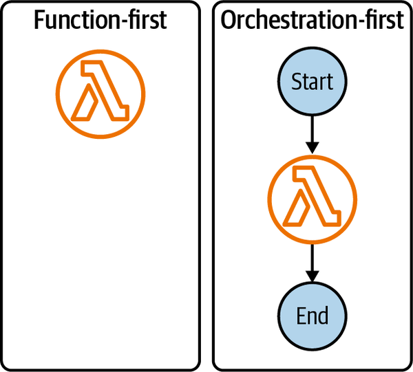

# 6. Implementing Serverless

## Embracing a Serverless-First Mindset and Adapting Development Processes

The transition to serverless requires a fundamental shift in development processes and team mindsets to unlock its full potential. Traditional approaches often hinder the benefits of serverless.

- **Adaptation is Key:** Although the code you write in your preferred programming language for serverless will likely be very similar to code you’ve contributed to websites, backends, and programs in the past, you’ll need to adapt your development process to unlock the full potential of serverless.

- **Sociotechnical Habits Must Adapt:** Teams migrating to serverless will realize that their sociotechnical habits must adapt in order for them to reap the maximum benefits of the shift. Put simply: there is no value in having an application that can constantly change if you cannot change it quickly and predictably.
- **Treading Lightly:** This concept, introduced in 2017, emphasizes accepting change as a constant and optimizing application and development processes accordingly. It advocates for implementations are made on the smallest possible scale without over-commitment to a single technology or methodology in order to facilitate future enhancement.

## The Evolving Nature of Serverless Engineering and Code

Serverless has evolved beyond Function as a Service to a comprehensive event-driven platform, shifting the focus of code development.

- **Lambda's Evolution:** AWS Lambda has grown far beyond its original ‘function as a service’ label to become a comprehensive event-driven programming platform, with new products like EventBridge and retrofitted classic services (S3, SQS, SNS) emphasizing event-oriented features.

- **Code as a Liability, Delegation is Key:** As the number of ways in which components in an application can be glued together has increased, the production code authored by engineers began to be viewed as a liability. Every line of code written and deployed is more real estate that must be tested, maintained, documented, and operated. There is a clear preference to delegate the undifferentiated heavy lifting to AWS and focus on solving domain-specific problems.
- **Infrastructure as Code (IaC) Dominance:** Serverless engineers increasingly write far more infrastructure code than business logic as they define and configure the various managed services that comprise their applications. This is a core benefit, enabling automation for creation, modification, and deletion of your application safely and efficiently.
- **Benefits of IaC:Replication:** Reliable and comprehensive replication across AWS accounts and environments.
- **Separation:** Simplified management by logically grouping resources.
- **Versioning:** Track changes and automatically roll back to previous versions.
- **Everything as Code Paradigm:** The IaC movement extends to defining many other operational aspects of software, including delivery pipelines, monitoring dashboards, alarms, synthetic canaries, and access control policies.
- **Writing Less Business Logic:** A growing trend is to only use Lambda functions to perform tasks when absolutely necessary and instead leverage various managed services to delegate work to AWS. This often involves Lambda functions transforming data, not transporting it, and enabling entire functionless architectures.

## Why do I write so much Infrastructure Code?

What began as a simple "function as a service" has evolved into a comprehensive event-driven programming platform with a vast array of managed services and application integration options. As the components of an application can be interconnected in more ways, the focus shifts from writing extensive business logic to defining and configuring the various managed services that constitute the application. As a result, engineers now find themselves writing significantly more infrastructure code than business logic.

## The Prevalence of Infrastructure as Code (IaC)

For modern software engineering teams operating at an enterprise scale, defining infrastructure as code (IaC) is crucial, moving practices beyond manual console configurations. The core benefit of IaC is automation, which enables the safe and efficient delivery of software by automating the creation, modification, and deletion of application resources.

IaC provides several key advantages:

- **Replication:** Infrastructure templates allow for the reliable and comprehensive replication of applications across different accounts and environments, supporting automated testing and disaster recovery. This embodies the "cattle, not pets" philosophy, where application instances are treated as disposable commodities created from templates.
- **Separation:** Complex, distributed applications can be simplified by grouping and managing resources with logical separations, such as by microservice or resource characteristic.
- **Versioning:** Changes to infrastructure resources can be individually tracked, and applications can be automatically rolled back to previous versions if needed.

Various tools and frameworks facilitate IaC, with some of the most common being AWS CloudFormation, AWS CDK, Serverless Application Model (SAM), Serverless Framework, Terraform, and Pulumi. When using these tools, it is often recommended to tread lightly and isolate microservices, even if employing multiple IaC tools.

By defining infrastructure as code, teams can better guard against security vulnerabilities, performance issues, and service outages, ensuring the infrastructure is verifiable, testable, adaptable, and portable. This "everything as code" paradigm has expanded to include delivery pipelines, monitoring dashboards, alarms, synthetic canaries, and access control policies, fostering an environment where applications can be built quickly and safely.

## IaC's Impact on Serverless Trends

- **Writing Less Business Logic:** With the growth of application integration, functions are increasingly used for transforming data rather than transporting it. This has given rise to "functionless architectures" where infrastructure code replaces a significant portion of traditional business logic.
- **Rapid Cloud Development:** IaC is central to improving the ergonomics of cloud-native development. It provides tighter feedback loops and enables engineers to work more closely with the cloud environment without relying on emulation.
- **Infrastructure and Configuration Testing:** When infrastructure configuration is defined as code, it can be statically verified and tested just like any other piece of code in the application.
- **Principle of Least Privilege:** Modern IaC tools can automatically generate least-privilege security policies and per-resource execution roles, simplifying adherence to security best practices.

## Environments and Stages with IaC

The ephemeral and stateless nature of serverless resources, combined with a pay-per-use model, supports a strategy of treating application instances as disposable commodities. IaC provides the powerful ability to template applications, allowing for the creation of an infinite number of replicas.

A common approach is to distinguish between these replicas using "stages" (e.g., production, staging). However, this can become a constraint on velocity and adaptability due to stage-specific environment variables scattered throughout the codebase.

An alternative, and often preferred, approach is to isolate environments by cloud account. Under this model, each account contains only a single version of the application (e.g., a "Production" account and a "Development" account).

In essence, serverless development necessitates a fundamental shift in focus toward infrastructure as code. This approach enables automation, replication, and robust management of cloud resources, leading to more efficient, adaptable, and secure applications.

## Core Principles for Serverless Application Design and Development

Specific guidelines for structuring code, managing dependencies, and optimizing Lambda functions are crucial.

- **Structure for Serverless: Monorepo Model:** Serverless applications with many microservices fit the monorepo model, standardizing tooling and allowing engineers to work across multiple services easily.

- **Colocation:** Colocating your infrastructure stacks… and Lambda function source code in the same top-level directory is recommended.
- **Single-Responsibility Principle (SRP) for Lambda Functions:** Do one thing and do it well. This encourages concise, performant functions, prioritizing computational efficiency and supporting the principle of least privilege.
- **Stay in a Single File (for Lambda functions):** While counter-intuitive for general software, keeping the code in a single file can be an invaluable technique for Lambda functions. It serves as a measure of increasing complexity, prompting re-evaluation of architecture if the file grows too large. This also makes applications more testable, evolvable, observable, and resilient.
- **Workflow Orchestration:** For complex business logic, AWS Step Functions can be used to execute tasks in a state machine–based workflow, decoupling tasks across single-responsibility Lambda functions. Benefits include complex business process mapping, conditional processing, visualization, fault tolerance, and native application integration

- > **NOTE:** Workflows offer a number of benefits: complex business process mapping, applying business rules and conditional processing, visualization of state machines via state charts, intrinsics (e.g., hashing, UUIDs, value interpolation, native application integration patterns, and SDK operations), waiting for events to complete (task callbacks, etc.), and fault tolerance.
- Prchestration-first approach will help you to contain the complexity of the business logic in your application as it grows and scales (see Figure 6-5). An orchestration-first approach to your serverless architecture involves wrapping Lambda functions in Step Functions workflows (state machines) as a default. Rather than invoking the functions directly, your events will execute the parent workflow. Orchestration-first allows you to evolve your architecture beyond a single function to multiple functions, or even to replace parts of your function with direct service integrations and intrinsic functions, by simply iterating on the workflow without requiring any major rearchitecting.

- **Lambda Powertools:** An indispensable set of tools for developing Lambda functions, primarily focused on observability (logger, tracer, custom metrics collector), with growing features for idempotency and parameter store integration.
- **Minimize Deploy-Time Dependencies:** Avoid tight coupling between microservices by not coupling interdependent resources in delivery pipelines at deployment time. Shared resources (S3 buckets, DynamoDB tables, EventBridge event buses) should ideally place the shared resource in a separate stack; not a single stack for all shared resources but a stack per shared resource.

- **Optimizing Lambda Functions: Understanding Concurrency:** Your unit of scale is concurrency. Throttling is a safety measure to protect resources and prevent downstream systems from being overwhelmed.
- **Managing Cold Starts:** While cold starts decrease as traffic increases (the more your application is used, the better it will perform), engineers should understand their impact and identify acceptable performance thresholds. AWS offers features like Provisioned Concurrency and Lambda SnapStart (Java only) for mitigation.
- **Optimizing Initialization:** Keep initialization code (outside the handler) to a minimum, but perform tasks that produce reusable objects (e.g., importing dependencies, opening database connections) in this phase.

- **Compute Performance:** Use AWS Graviton2 processors for better performance and lower cost, consuming up to 60% less energy.
- **Performance Analysis:** Utilize Lambda Insights for monitoring metrics like memory consumption, execution duration, and cost. AWS Lambda Power Tuning can suggest the optimum configuration to minimize cost and/or maximize performance.

## Leveraging Managed Services and Direct Integrations

The true power of serverless lies in blending Lambda compute with AWS-native service integrations, delegating undifferentiated heavy lifting to AWS.

- **Evolution to Event-Driven Platform:** Lambda's integration with around 30 services has transformed it from a FaaS into a complete event-driven programming platform.
- **Delegating to Experts:** You can delegate computing, storage, workflow orchestration, and event streaming to the experts and concentrate your energy on building the best application for your users.
- **Avoid Function-to-Function Calls (Antipattern):** Invoking a Lambda function from another function is generally considered an antipattern due to tight coupling, difficulty handling failures, and paying for idle wait periods.
- **Function vs. Functionless:** Consider if a native service integration can be used instead of a Lambda function, as Lambda functions have an obvious labor cost for testing, operation, and maintenance.
- **Managed Services for Specific Tasks:Event Communication/Routing:** Use services like Amazon EventBridge, SNS, Kinesis, or SQS, to transmit messages between producers and consumers and trigger activity. As Ajay Nair states, Use Lambda functions to transform, not transport.
- **Event Batching:** Prefer managed services over custom implementations.
- **HTTP Requests:** Use Step Functions HTTP task or EventBridge API destinations if no response handling is needed.
- **Intensive Compute:** For large-scale parallel data processing, use Step Functions map or distributed map to invoke a single Lambda function concurrently.

## Continuous Delivery and Operational Excellence

A culture of frequent, predictable, and boring deployments is paramount, requiring automation and a shift in perspective on environments.

## Tip

It is not necessary to be dogmatic when it comes to continuous integration and delivery. There is a lot of advice on best practice in this area, but the most important thing is to do what works for your team. Whether you choose to use feature branches and pull requests or trunk-based development and pair programming, the most vital aspect of software delivery is to mandate automation at every stage of your pipeline. Pipeline automation ensures that you can ship as often and as rapidly as possible while maintaining safety and stability.

- **Production is Just a Name:** AWS accounts are just accounts; there is nothing special about your production account, other than the fact that you choose to expose it to your users. Environments are purely constructs with little meaning outside of your development workflow.
- **Ship on Day 1, and Every Day After:** Prioritize building an automated delivery pipeline from the start and continuously deploy changes. This makes delivery a habit and removes fear. High-performing teams achieve code-to-production in between one day and one week.
- **The Case for Continuous Serverless Delivery:** Deploying an application or feature to production before it's fully built seems counter-intuitive but simplifies the process by avoiding missing permissions, failed tests, or environment bootstrapping issues.
- **Benefits of Continuous Delivery:** Trivial to associate bugs with specific commits; avoids arduous root cause analysis in batched deployments.

- **Guidelines for Continuous Serverless Delivery:**
  - **Practice GitOps:** Treat Git repository as the single source of truth, triggering deployments on code pushes to the trunk branch.
  - **Optimize for Experimentation:** Decouple components and iterate regularly. Ship it and see!
  - **Normalize Deployments:** Remove the fear and ceremony around deploying to production—normalize it.
  - **Deployment is Not Release:** Separate the deployment phase (delivering code to AWS account) from the release phase (delivering to users). This allows for incremental deployments and different release strategies:
  - **Dark Releases:** Deploy new features without user awareness.
  - **Feature Flags:** Target specific user groups (e.g., via AWS AppConfig).
  - **Canaries:** Gradual rollout to a percentage of users (e.g., via AWS CodeDeploy for blue/green deployments).
  - **Boring Delivery Pipelines:** The goal is safe, fast, and predictable delivery, which is primarily a social challenge. Automation is key to normalizing delivery.
  - **Jidoka Principle:** Applied to software delivery, pipelines should be observable, issues should trigger alerts, and fixing delivery issues should be the highest priority, pausing all feature work.
  - **Continuous Integration (CI):** Regularly apply code changes to the releasable version. Serverless architectures excel with CI due to loosely coupled microservices, allowing tiny increments and isolated deployments. CI helps catch conflicts and bugs early.
  - **Avoid Ephemeral Environments for CI:** Ephemeral environments provisioned to test code changes in feature branches can be considered the antithesis of continuous integration. They create overhead and slow progression to production.
  - **The Perfect Pipeline:Atomic:** Isolated pipelines per service/stack, individual changes.
  - **Automated:** GitOps approach, automate all steps, avoid manual intervention.
  - **Observable:** Issues trigger alerts and are diagnosable.
  - **Rapid:** Define maximum execution time, monitor, and optimize.

## Documentation and Solution Design

Despite the dynamic nature of serverless, effective documentation is crucial, focusing on quality over quantity.

- **Quality Over Quantity:** Trying to document everything will rarely be a sustainable strategy. Instead, you should focus on documenting the most crucial aspects of your architecture—the parts you will need to understand when debugging production issues or making large-scale changes.
- **Treat Documentation as a Feature:** Prioritize based on demand and criticality. Archive outdated documents.
- **Solution Design Process:** A pre-implementation design phase is crucial to the effectiveness of your application. It should cover requirements, data flows, architecture diagrams, data modeling, event design, threat modeling, reliability, cost, and sustainability.
- **Living Documents:** Solution designs are living documents that should embrace the messiness within the structure!
- **Minimum Viable Documentation: Contributing Guidelines:** Clear instructions for building, running, testing, and deploying.
- **Solution Designs:** Pre-implementation designs, data contracts, vendor quotas, architectural decision records.
- **Architecture Diagrams:** Visualize system architecture, data flow, and key configuration details.
- **State Charts:** For Step Functions workflows.
- **Event Schemas:** Document every event, including state changes and field details.

## Insights from Sara Gerion (Senior Solutions Architect, AWS)

An industry expert reinforces several key themes and offers practical advice.

- **Accessibility of Cloud for Backend Engineers:** Serverless made the entrance to the world of cloud more accessible to backend engineers who did not have much cloud experience beforehand. There is no need to learn how to manage servers at scale.
- **Engineers Closer to Observability:** Because of the monitoring solutions like logging or metrics provided out of the box by using serverless, I also observed that engineers got closer to the observability space and best practices.
- **Shared Responsibility & DevOps:** Backend engineers tend to own and maintain not only the code of the business logic, but also the infrastructure as code codebase and the observability of the architecture and backend application. This fosters a you build it, you run it mindset and wider adoption of DevOps.
- **Boring Serverless Releases:** Frequent, uneventful, and predictable releases empower teams. Strategies include:
- **Monitoring Solutions:** Minimum viable product should include tracing, logging, dashboards, and alerts.
- **Automated Tests:** Improve quality, reduce manual effort, accelerate development.
- **Incremental Release Strategy:** Plan from the beginning for fast iterations.
- **Deploy Turned Off with Feature Flags:** Deploy new functionality to production before it's user-ready.
- **Fault Tolerance & Automated Error Handling:** Design for resilience.
- **Importance of Community:** The serverless community is fast-paced, ever-evolving, and crucial for defining best practices, offering diverse perspectives, open-source projects, and learning resources.
- **Advice for Lambda Functions:** Adopt Powertools for AWS Lambda to implement serverless best practices without the need to write much custom code. It relieves operational burden and helps standardize organizational practices.
- **Value of Documentation:** Up-to-date, easy-to-understand documentation can accelerate the onboarding of a new team member. It also helps retain knowledge within the team and clarify past decisions or design choices. Architecture designs should be living documents and created *before* implementation to brainstorm, validate, avoid rewrites, and seek feedback.
