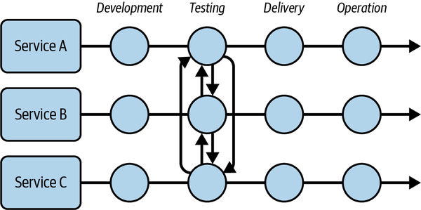
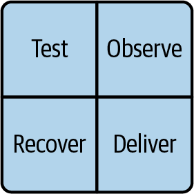
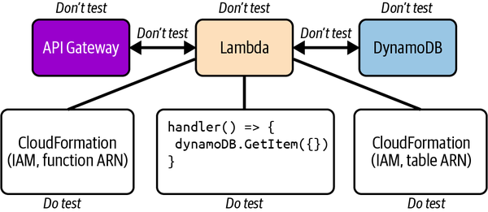
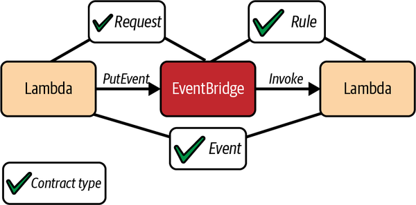

# 7 Testing Strategies for Operating Serverless

## The Evolving Landscape of Software Quality and Inevitable Bugs

The traditional approach to software quality, focused on eradicating bugs, is no longer sufficient for modern applications. Software today is "cloud native, geographically and logically distributed, and a mixture of first-party, third-party, and open source code." User demands for "highly available, low-latency, and in a constant state of iteration" applications necessitate a new testing paradigm.

A fundamental premise is that **"BUGS ARE INEVITABLE."** As Andrew Jackson of the American Go Association remarked on AlphaGo, "If DeepMind has figured out how to write code that doesn’t have bugs, that is a bigger news story than AlphaGo." This inevitability calls for a shift in mindset: instead of aiming for complete bug eradication, teams should "learn to live with, and even embrace, the bugs in your software," focusing on rapid detection and recovery.

## Challenges Unique to Serverless Testing

Serverless applications present distinct attributes that challenge traditional testing methodologies:

- **Decoupled by Design, Coupled in Testing:** While serverless fosters decoupling (microservices, event-driven architecture), "approaches to testing software have not kept up." Traditional strategies often "couple it again during testing," leading to rigid, full-system deployments for testing.

- **Event-Driven Communication:** The asynchronous nature of event-driven architectures makes them "notoriously difficult to test when applying strategies not fit for purpose."
- **Managed Services:** Serverless heavily relies on AWS-managed services, which are "opaque boxes dotted around your architecture; components you do not own, control, or fully understand." This raises the question of what parts of these services to test. The mantra "If you can’t fix it you shouldn’t test it" applies here, implying a focus on owned code and configuration.
- **Distribution:** Whole applications and microservices are distributed across various cloud resources, regions, and accounts, making "systems under test moving targets."
- **Cloud Native:** Serverless is born in the cloud, making it "inordinately difficult to run traditional integration and functional tests without deploying resources to the cloud." This results in "a longer feedback loop and development cycle and can severely slow test execution."

**Key takeaway:** "Treating a serverless application as a single application simply does not scale as the codebase grows. You should instead view your serverless system as a collection of distinct applications." Quality control must be applied to these individual components, avoiding coupling in tests.

## The Serverless Square of Balance Balancing Delivery and Stability

The "serverless square of balance" (Test, Deliver, Observe, Recover) is a crucial framework for achieving resilient, high-quality serverless applications. These activities must be "designed and undertaken in the most efficient way possible" and "balanced against one another, without overly relying on one or two techniques."

- **Speed Over Stability (Initially):** "In most cases, speed should always be preferred to stability. Stability is a product of speed; without speed there is no stability."
- **Move Fast and Make Things:** Research from DORA indicates that "high-performing teams delivered code into production...440 times faster than low-performing teams while having a change failure rate 5 times lower." This contradicts the notion that speed sacrifices quality.
- **Balancing Test Coverage with Observability and Recovery:** "As your serverless application grows, exponentially adding tests for new features and regressions will prove to be the biggest drag on delivery speed." The solution is to "balance between pre-deployment testing and observability and resiliency in production." Reducing pre-deployment test coverage is an "effective strategy to improve delivery speed," but it "should be balanced with other forms of QA, including alerting...and the ability to recover from any bugs."

## Designing an Effective Serverless Test Strategy

A clear test strategy is "absolutely crucial to the scalability of its development and its stability."

- **Focus on Business Logic via Unit Tests:** The "bulk of business logic testing can thus be achieved through unit tests that assert the various operations of a Lambda function." Sarah Hamilton emphasizes this as "nonnegotiable" for both startups and enterprises due to its low overhead and high confidence return.
- **Mocking Side Effects:** To keep unit tests "predictable (and fast), side effects must be mocked." This is particularly relevant for "network requests to third-party vendors or AWS SDK calls." Mocking should be isolated to "individual tests and units under test rather than mocking once on a global level." Sarah Hamilton specifically advises mocking third parties, stating, "Your tests should test the code that you can control, not the third-party code."
- **Static Analysis:** For languages supporting static typing, "static analysis as a method to verify the requests sent to a third party and your handling of their responses" is highly recommended. Type definitions can serve as data contracts.

## Identifying Critical and Noncritical Paths

Not all parts of an application require the same level of testing rigor.

- **Critical Paths:** These are "user experiences that are critical to the operation of your business." For these, "recovery from failure (or fault tolerance) is a less viable strategy." Their "operational quality...should be primarily supported through extensive test coverage and alerting." Load testing critical paths is also essential.

Integration points testing checklist
For each integration point you should capture the failure modes for the categories listed in Table 7-1 and decide whether to cover them with tests.

| Failure category | Description | Recommended tests |
| --- | --- | --- |
| **Configuration** | You are responsible for configuring the integration points between managed services, such as event buses and rules. You should verify that the integration exists and is configured according to AWS rules and your business requirements. | Infrastructure tests, unit tests |
| **Permissions** | You are responsible for granting the necessary permissions for integrated components to interact with each other. You should verify that the source component has permission to publish events or messages and the target has permission to consume them. | Infrastructure tests |
| **Payloads** | The communication channel and message payload used by integrated components should be verified to ensure that an event producer is sending messages according to the contract and the consumer is handling input according to the contract. | Unit tests, contract tests, static analysis |

- **Noncritical Paths:** These are "usually background processes," which are "not time-sensitive and will be fully recoverable." Their quality "should be primarily supported through alerting and fault tolerance." Teams "can afford to ship a higher percentage of bugs that disrupt these paths."

## Just Enough and Just-in-Time Testing

- **Just Enough Testing:** "Test coverage should be kept to a minimum and be focused on your critical user experiences." The goal is "not about catching all possible bugs, it’s about catching the bugs that will wreak the most havoc on the user experience." Strategies include reducing tests for stable experiences, temporarily increasing for unstable ones, and removing tests that rarely fail or are flaky. Mutation testing can help identify useless tests.
- **Just-in-Time Testing:** Limiting *when* tests are run is as important as limiting *what* is tested. "The closer you test your code to production, the more valuable the results of these tests will be." This implies "shift right on testing," performing "the bulk of testing just before deploying to production."
- **Environment Strategy:** "Simulating the variables and emergent complexity of your serverless application’s production environment is impossible." Therefore, "run tests in as few environments as you are comfortable with; ideally no more than one or two." The proliferation of "ephemeral pull request environments" for every pull request is "the antithesis of continuous integration" and should be used "sparingly for specific scenarios." Instant environments for isolated component testing are preferable.
- **End-to-End and Integration Testing:** Sarah Hamilton advocates for "End-to-end tests are crucial, and the real infrastructure should be tested upon." She suggests breaking down broad end-to-end tests into "Integration tests" to "diagnose a fault" more precisely. For asynchronous serverless applications, she recommends "implementing retries on the assertions you are making" in tests to account for eventual consistency.

## Contract Testing Integration Points

Instead of deploying and invoking entire microservices for integration testing, "you can use data contracts to verify the correctness of integrations." This is a form of unit testing that statically verifies requests and responses against agreed-upon data types (e.g., JSON Schema).

For each integration point, the focus is on testing three elements, for which the user is responsible:

- **Configuration:** Verifying that "the integration exists and is configured according to AWS rules and your business requirements" (e.g., EventBridge rules). This can be done with infrastructure tests or unit tests.
- **Permissions:** Ensuring "the source component has permission to publish events or messages and the target has permission to consume them." This is verified through infrastructure tests.
- **Payloads:** Confirming that "an event producer is sending messages according to the contract and the consumer is handling input according to the contract." This is typically done via unit tests and contract tests (e.g., using JSON schema validation) and static analysis.

**Crucial point:** "Whenever possible, test the source and target of an integration point separately."

## Upholding Standards with a Definition of Done

A "Definition of Done" provides a clear indicator of when a change can be released. It should address:

- How quality will be measured (SLOs, performance, business metrics).
- How code will be released to production.
- How to know if code is broken *before* production (pre-deployment tests).
- How to know if code is broken *in* production (alerts).
- How to debug broken code (distributed tracing, logs, runbooks).
- How code will recover from failure (fault tolerance, recovery mechanisms).

The "Cult of Done Manifesto" reminds that "Nothing is ever truly done. Software is never perfect. Bugs are inevitable." The focus is on getting something into users' hands to gather data and inform improvements, recognizing that "the best software is always software that is being used."

# Interview with an Industry Expert

Sarah Hamilton, AWS Community Builder and Senior Software Engineer
Sarah Hamilton is a Senior Software Engineer and an AWS Community Builder. During her career she’s been a huge supporter of serverless technology, and she takes great pride in contributing to the entire development cycle, from designing architectures to the hands-on process of building and deploying solutions. Sarah enjoys sharing her knowledge by speaking at conferences and writing blog posts.

**Q: Serverless has matured as a technology in the last couple of years, and best practices continue to evolve. However, testing still seems to be something teams find difficult to get right with serverless. How do you see the current state and best practice of serverless testing?**

****Undoubtedly, the testing of serverless applications is frequently overlooked or seen as an afterthought. Whilst I believe that our overall understanding of testing serverless applications is improving, there is still a lot of work to do. There are a few reasons why I believe we haven’t progressed at a faster rate.

Firstly, whilst testing strategies for frontend applications are generally well understood and well documented, with unit tests for business logic and end-to-end browser tests, there is a lack of understanding over exactly what to test in the backend. A lot of my testing knowledge comes from speaking to others in the community and asking what they do. I will outline my current strategy toward testing:

1. Write unit tests for business logic before writing the logic itself. This is in line with traditional test-driven development. However, I find it to be far more important in serverless development as it speeds up your development feedback loop. You can simply develop while running your tests rather than deploying to test that your business logic works.

2. End-to-end tests are crucial, and the real infrastructure should be tested upon. When we build tests, we want to ensure that the testing environment mimics the production environment, and the best way to do this is to test on a deployed copy of the production environment. One caveat is that end-to-end tests tend to require more development time and creativity, and take longer to run in your CI/CD pipeline. That is why I would advocate choosing business-critical flows to test and investing in those. As an example, take a payment system comprising a few different services. An end-to-end test may simply be “Given an order is placed, then the orders table is updated.” Whilst many different processes may have taken place in the services in between, the end-to-end test is capturing that a particular input produces a particular output. This is a useful test, as it indicates the overall health of the system. If the test fails, then we can assert that something is wrong. But how do we diagnose the exact service that is broken?

3. Integration tests! To have a better view of the system and diagnose a fault, it is important to have integration tests that test a narrower part of the system. You may have several integration tests which break down the overall end-to-end test. The following would be examples of integration tests:

    1. “Given an order is placed, then an `orderCreated` event arrives on the event bus.”
    2. “Given an event arrives on the event bus, then the orders table is updated.”
You can see that the end-to-end test has been broken into two. If *a* fails and *b* passes, then we can assume there is a fault at the beginning of the flow—but the end-to-end test does not give you that level of detail.

Another issue that arises for developers writing tests is how to deal with the asynchronous nature of serverless applications. When testing on real infrastructure, you must handle the time taken to complete a process—after all, you designed your architecture to be decoupled and asynchronous. Unfortunately, there is no particularly smart way of handling this at the time of writing. I would opt for implementing retries on the assertions you are making and, after a reasonable amount of time, failing the test if your expected result doesn’t come back. Of course, these timings and the number of retries can be tweaked as you get to know how your system performs.

In addition to this, some serverless services cannot be inspected easily with the cloud SDK you are using. Storage services can often be easily asserted, as you can usually get the object with the SDK and check the result you are expecting. Other tests can be trickier. Recently, I wanted to test that “Given an object is placed in storage, then the output of the subsequent function is X.” I soon realized that I had no way of inspecting the output of the actual function using the SDK. I found myself writing unwieldy tests to inspect the logs to find the output which had been logged in the function. The test required many retries of various SDK calls. In the end, the test worked, but I decided to abandon it because it was not robust and would be confusing to any other developer who came across it. I decided that the end-to-end test would suffice. The lesson I learned from this is that integration testing is sometimes difficult and overcomplicated, but invaluable when done properly.

**Q: As a serverless consultant you worked with many start-ups building diverse serverless applications. How did the test strategies differ between these teams and projects?**

****Given the context of collaborating with start-ups aiming to swiftly deliver applications to customers, a strategic decision must be made regarding the extent to which testing should be undertaken, with the ultimate goal of achieving a high-quality application.
During my time as a consultant, it was clear that some stakeholders, possessing a background in development, understood the significance of writing tests and upholding quality. Conversely, other stakeholders, with a background in business, emphasized speed over quality to meet deadlines. Consequently, the scope of testing could vary somewhat between projects.

With the passage of time, my perspective has evolved, highlighting the necessity of personally advocating for quality assurance. I now ensure that I withhold the label of “completion” until a satisfactory level of testing accompanies the code being deployed. That’s not to say that you shouldn’t have some flexibility, because “satisfactory” really does vary depending on the scale of the application being developed.
My definition of “satisfactory” (in terms of testing) for a start-up looking to quickly deliver to market would look something like the following:

1. Unit testing is done to a high standard—which means that there is high coverage. Any business logic should be well tested. Whether this is a start-up or a larger enterprise, this is nonnegotiable. It’s a quick win and delivers a lot of confidence in your code and business logic. They also have a low overhead—unit tests tend to run extremely quickly, and therefore don’t take up a large amount of time and resources in your CI/CD pipeline. In addition to this, artificial intelligence pair programmers are very effective at writing unit tests for code, making them extremely quick to produce (of course, these should be used with caution and should only be used as a guide). Code changes should not be merged without unit tests accompanying business logic.

2. An end-to-end/integration testing strategy is put together for business-critical paths. End-to-end/integration testing can be somewhat time-consuming, so it’s understandable that a vast amount of time spent on this may not be welcomed by stakeholders pushing to get a product out. This is where it’s about compromise. Identify your business-critical paths—the paths that must work for the application to be functional. For an ecommerce website, this may be the “modifying cart” flow and the “payments” flow. Once you have identified these, think of a testing strategy that will be effective, but also efficient. Usually, a simple end-to-end test will be a good fit, testing that an input produces a certain output. This will give you the confidence that your overall system is working as expected.

**Q: As well as working with start-ups on greenfield projects, you have also seen how mature, enterprise-scale workloads operate in production. How do the enterprise teams you’ve worked with approach testing event-driven serverless systems, and what role do quality assurance engineers play?**

****At the enterprise level, the impact associated with defects on an application can be very high (in terms of revenue loss, brand reputation, etc.). Consequently, as companies expand and evolve, more money is invested in upholding quality standards.

Whilst application engineers continue to write their own unit tests and integration tests where they see fit, QA engineers are designing and implementing clever end-to-end tests, regression testing, and ensuring quality is upheld within teams. Of course, application engineers would likely have the skill set to do this; however, many of the more complex tests and overall upkeep of the test suite can be very time-consuming and distract from features those engineers are building. In my view, a notable distinction between start-ups and larger enterprises concerning testing lies in the pronounced emphasis on test coverage, balanced with the efficiency of the CI/CD pipeline to maintain productivity.

One challenge in enterprises is the mindset shift from manual QA work to writing effective automated tests for serverless applications. Since writing tests for serverless applications will likely require the use of an SDK to interrogate cloud resources, it can be a steep learning curve. It is important that this learning curve is taken, as I believe that automated testing is the only way a business can scale with confidence in the increased number of deployments. I believe that QA engineers can get more job satisfaction by owning and maintaining a comprehensive test suite. I have also found that this shift in mindset helps QA engineers and application engineers work more closely together and thus achieve higher-quality products.

**Q: You are an outstanding member of the AWS and serverless community, notably as an AWS Community Builder, speaker, podcast guest, and open source contributor. What role can the community play in improving the state of affairs when it comes to serverless testing?**

****I’ve spoken to many developers about their thoughts on how to test serverless applications, and it is clear to me that there is currently no “golden path” regarded by serverless engineers. I think that the best way to develop best practices for testing serverless applications is to share our knowledge with each other. Therefore, I think it is very much the community that can drive innovation in our approach to testing serverless applications. Approaches can be very opinionated, and therefore it is beneficial that we have increasing content so that developers can form their own opinions on how best to test their applications.

Back in 2021, I wrote a blog article about an integration testing strategy for EventBridge-based serverless architectures. I didn’t anticipate a wide readership, but I believed it was worthwhile to share the strategy my colleagues and I had devised. I consider the blog post a success as it continues to attract a substantial readership even today. However, I believe a contributing factor to its sustained reader interest is the relatively limited amount of content available on this subject—there is a clear need for more opinions on this topic!

I think many people are worried about putting the “wrong” opinion out there for all to see. However, we can all only speak from our own experiences, and those experiences are not “right” or “wrong.” Personally, I’d love to see more blog posts delving into the challenges and setbacks developers have encountered. At times I think of something to try out, only to discover a lack of related content. Yet, after investing time working on it, I realize it doesn’t work in the way I’d like. It’s possible that many others have tried the same thing as me, but chose not to share their unsuccessful experiences, as we generally refrain from publicizing our failed attempts. However, I firmly believe that expanding our collective knowledge base empowers us all.

**Q: What advice would you give to enterprise software teams starting out with serverless testing?**

****First and foremost, ensure that you have good coverage on your unit tests and end-to-end tests written for your business-critical paths—those are the basics. Once you have those covered, you can begin to think about integration testing, which can help developers to diagnose issues more efficiently.
****

During this Q&A, I’ve purposefully avoided discussing mocking and so-called “offline testing.” As a rule of thumb, I’d always opt for testing on the real infrastructure for integration and end-to-end testing.

However, that isn’t to say there isn’t a place for mocking. Mocking third parties can be especially useful. Your tests should test the code that you can control, not the third-party code. Third parties go down often, which will cause tests to fail. When the tests are integrated into the CI/CD pipeline, the engineers will be blocked from pushing code into production. However, this shouldn’t be the case if the fault isn’t due to the codebase you can control.

Therefore, large enterprises may want to think about a strategy to mock third parties—if you do this and your test fails, then you know that it’s down to something under your control and not a third-party error. If you do choose to mock your third parties, then the response should be identical to what you would expect from the third party so that it mimics what should happen. Therefore, if you have the basics covered and are looking to improve your integration/end-to-end tests, I’d suggest setting up a way of mocking the third parties that you use. I advise this for enterprises, as the initial investment is worth it when you have many engineers working on a codebase that could be blocked by the unnecessary failure of the tests.

Write unit tests for business logic before writing the logic itself. This is in line with traditional test-driven development. However, I find it to be far more important in serverless development as it speeds up your development feedback loop. You can simply develop while running your tests rather than deploying to test that your business logic works.

Unit testing is done to a high standard—which means that there is high coverage. Any business logic should be well tested. Whether this is a start-up or a larger enterprise, this is nonnegotiable. It’s a quick win and delivers a lot of confidence in your code and business logic. They also have a low overhead—unit tests tend to run extremely quickly, and therefore don’t take up a large amount of time and resources in your CI/CD pipeline. In addition to this, artificial intelligence pair programmers are very effective at writing unit tests for code, making them extremely quick to produce (of course, these should be used with caution and should only be used as a guide). Code changes should not be merged without unit tests accompanying business logic.

End-to-end tests are crucial, and the real infrastructure should be tested upon. When we build tests, we want to ensure that the testing environment mimics the production environment, and the best way to do this is to test on a deployed copy of the production environment. One caveat is that end-to-end tests tend to require more development time and creativity, and take longer to run in your CI/CD pipeline. That is why I would advocate choosing business-critical flows to test and investing in those.

As an example, take a payment system comprising a few different services. An end-to-end test may simply be “Given an order is placed, then the orders table is updated.” Whilst many different processes may have taken place in the services in between, the end-to-end test is capturing that a particular input produces a particular output. This is a useful test, as it indicates the overall health of the system. If the test fails, then we can assert that something is wrong. **But how do we diagnose the exact service that is broken?**

Integration tests! To have a better view of the system and diagnose a fault, it is important to have integration tests that test a narrower part of the system. You may have several integration tests which break down the overall end-to-end test. The following would be examples of integration tests:

“Given an order is placed, then an orderCreated event arrives on the event bus.”

“Given an event arrives on the event bus, then the orders table is updated.”

You can see that the end-to-end test has been broken into two. If the first test fails and the second passes, then we can assume there is a fault at the beginning of the flow—but the end-to-end test does not give you that level of detail.

An end-to-end/integration testing strategy is put together for business-critical paths. End-to-end/integration testing can be somewhat time-consuming, so it’s understandable that a vast amount of time spent on this may not be welcomed by stakeholders pushing to get a product out. This is where it’s about compromise. Identify your business-critical paths—the paths that must work for the application to be functional. For an ecommerce website, this may be the “modifying cart” flow and the “payments” flow. Once you have identified these, think of a testing strategy that will be effective, but also efficient. Usually, a simple end-to-end test will be a good fit, testing that an input produces a certain output. This will give you the confidence that your overall system is working as expected.
