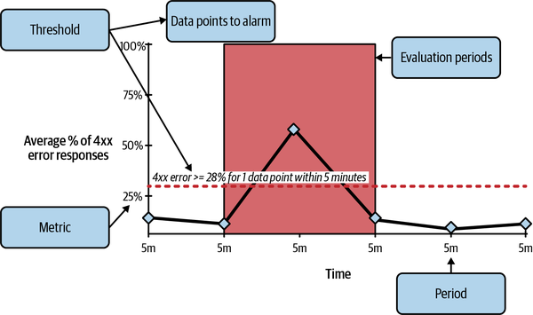
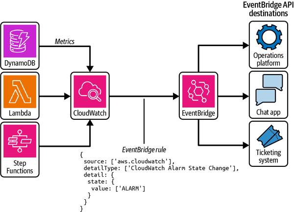
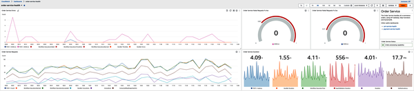
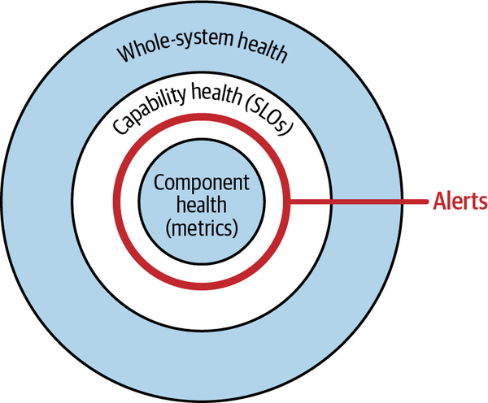
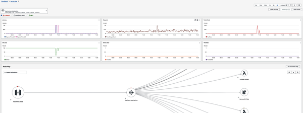
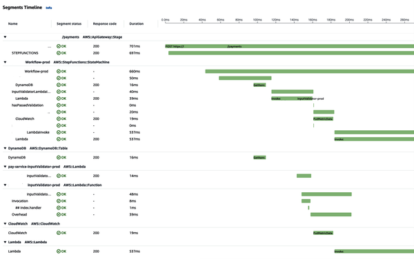
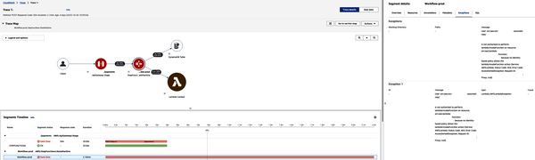
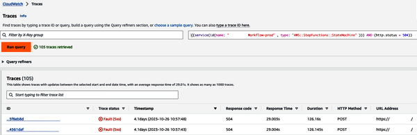
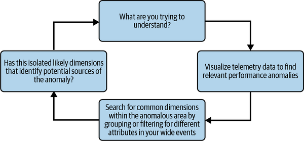
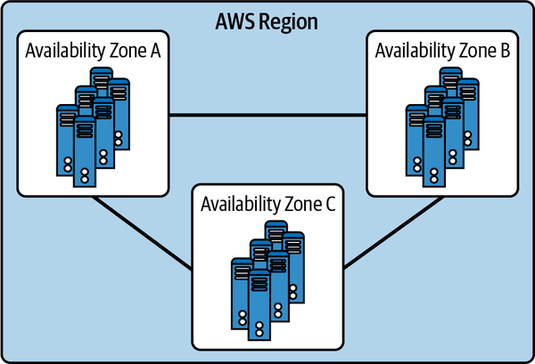

# 8. Operating Serverless Applications in Production

## Introduction to Operating Serverless

Operating serverless applications in production shares fundamental goals with traditional software operations: ensuring performance, receiving alerts, recovering from incidents, and debugging. However, serverless's unique characteristics, particularly **automatic scalability and pay-per-use billing**, necessitate adjustments to traditional approaches. As Yan Cui states, with serverless, "there is a lot less for you to do, so it frees you up to focus on things that actually differentiate your business." This shifts focus from infrastructure monitoring to application-level concerns, allowing engineers to concentrate on "the things that matter, not the infrastructure beneath them."

## Scalability and Service Limits

Serverless technologies provide automatic scaling of compute, storage, and communication, making them ideal for applications with fluctuating demand. However, this advantage comes with crucial responsibilities:

- **Understanding Units of Scale:** Engineers must know the specific units of scale for each managed service (e.g., Lambda's function execution concurrency, DynamoDB's read/write capacity, Kinesis streams' input/delivery limits).
- **Adhering to Service Limits (Quotas):** AWS managed services have implicit usage contracts with documented quotas. Engineers must be "very familiar with the quota pages in the documentation" and understand whether limits are soft (can be increased) or hard. This understanding should be integrated into "solution design process and cost estimation."
- **Application-Level Scalability:** Even if underlying services scale, the application itself may not if not designed with scale in mind. Deploying to production "from day 1 and every day after" is crucial for continuous analysis and optimization for serverless scale.

## The Paradigm Shift to Observability

Observability is paramount for serverless operations, moving beyond traditional monitoring.

- **Definition:** Observability is "a measure of how well you’re able to infer the internal state of a system just from its external outputs." It's about "ensuring the data is there when you need to answer questions about your application’s behavior."
- **Shift from Active Monitoring to Passive Observability:** Unlike active monitoring where engineers "watching dashboards and trying to spot anomalies," observability is a passive process. Engineers should "have confidence in your alarms to alert you to potential problems and in your metrics, logs, and traces to support efficient debugging when required."
- **Necessity for Serverless:** The highly distributed, ephemeral, event-driven nature of serverless applications makes traditional monitoring inadequate. Observability is "not so much a good fit for serverless, but a mandatory requirement for operating any system in the real world, serverless or otherwise."
- **Built-in Observability:** Observability "cannot be a post-deployment afterthought" but must be a concern "at every stage in your software delivery lifecycle, from design and development to operation and monitoring."

## Key Pillars of Serverless Observability

## Observing Critical Paths and Health Dashboards

Instead of monitoring "everything," focus on "the most critical parts of your application; the parts that must be working at all times."

- **RED Method:** Apply the RED method to ascertain critical health:
- **Rate:** The rate of requests being received.
- **Errors:** The number of requests that are failing.
- **Duration:** The time taken to respond to requests.
- **Critical Health Dashboard:** Create a dashboard showing RED metrics for core components, providing "a single view of system health." This aids in spotting "potential anomalous performance" and verifying the impact of code changes. However, it's crucial to "resist trying to monitor decoupled services as one whole system."

## Metrics, Alarms, and Alerts

- **Metrics:** Data providing insights into system performance and health, emitted by managed services or custom code (e.g., Lambda Powertools). All AWS native and custom metrics are sent to CloudWatch.
- **Alarms:** A combination of a metric and a threshold. When the metric breaches the threshold, the alarm triggers.
- **Alerts:** Actions performed when an alarm triggers (e.g., sending messages, creating bug reports).
- **Alert Properties:** Useful alerts should be:
  - **Obvious:** Clear impact on user experience/critical path.
  - **Actionable:** Associated with a clear action.
  - **Singular:** One alert per distinct issue, avoiding "alert noise."
  - **Core Serverless Service Metrics:** The document lists key metrics for common serverless services to monitor for scale and performance:

Metrics to look out for with Serverless:

## Lambda

- **Account-level concurrent function executions:** Tracks the total number of concurrent executions across all functions in your account. This is crucial for understanding your overall usage against AWS limits.
- **Errors:** The number of invocations that resulted in an error. A high error rate can indicate issues with your code or configuration.
- **Throttles:** The number of times your function invocations were throttled because you exceeded the concurrency limit.
- **Memory Usage:** The amount of memory your function used during execution. Monitoring this helps optimize cost and performance.
- **Duration:** The time it takes for your function to execute. Longer durations can increase costs and impact user experience.

---

## API Gateway

- **Total Requests:** The total number of requests made to your API. This helps in understanding the traffic patterns.
- **4xx/5xx-series Errors (Percentage):** The percentage of client-side (4xx) and server-side (5xx) errors. This is a key indicator of the health of your API and its backend integrations.
- **Latency:** The time it takes for a request to be processed by API Gateway and a response to be returned. High latency can point to performance bottlenecks.

---

## Step Functions

- **Executions Started:** The number of new state machine executions initiated.
- **Executions Succeeded:** The number of executions that completed successfully.
- **Execution Aborted:** The number of executions that were manually stopped.
- **Execution Failed:** The number of executions that failed due to an error.
- **Execution Throttled:** The number of execution start requests that were throttled.
- **Execution Timed Out:** The number of executions that exceeded the configured timeout.
- **Execution Time:** The total time taken for an execution to complete.

---

## DynamoDB

- **Consumed Read/Write Capacity Units:** The number of read and write capacity units consumed. This is essential for managing costs and ensuring you have provisioned enough capacity.
- **Throttled Requests:** The number of read or write requests that were throttled because the provisioned throughput was exceeded.
- **User Errors:** Errors that occur due to issues on the client-side, such as providing incorrect query parameters.

---

## SQS

- **Approximate Age of Oldest Message:** The age of the oldest message in the queue. A consistently high value can indicate that your consumers are not processing messages fast enough.

---

## Kinesis Firehose

- **Incoming Bytes/Records:** The volume of data in bytes and the number of records being sent to your Firehose delivery stream.
- **Data Freshness:** The age of the oldest record in the delivery stream that has not yet been delivered to the destination.
- **Success:** The percentage of records that were successfully delivered to the destination.
- **Throttled Records:** The number of records that were throttled due to exceeding the configured limits.

---

## EventBridge

- **Triggered Rules:** The number of times a rule was triggered by an event.
- **Dead Letter Invocations:** The number of times an event failed to be delivered to a target and was sent to a dead-letter queue.
- **Failed Invocations:** The number of times a target invocation failed.

## Capability Alerting and Service Level Objectives (SLOs)

- **Capability Alerting:** Instead of granular, resource-specific alerts, this approach assesses "the overall health of a critical component or service in your system" by combining metrics across components for a specific workflow (e.g., PDF generation). This reduces noise and pinpoints problem areas more effectively.
- **Service Level Objectives (SLOs):** "Targets for performance that provide an indication of how often your service can fail before the experience of your users is significantly degraded." SLOs are built upon Service Level Indicators (SLIs), which are binary measures of good/bad service performance. The goal is to operate at an acceptable level of unreliability, rather than striving for "the impossible goal of perfection."
- **Decoupling 'What' from 'Why':** Alerts should only tell you "what is wrong." Discovering "why something went wrong" comes after, using logs, traces, metrics, and dashboards. "If you attempt to use your alerts to tell you why something went wrong, you are likely to end up with a barrage of meaningless, unactionable alerts." SLO-based alerts simplify this by indicating a capability is not working as expected, leading into the core analysis loop.

## Event-Driven Logging

- Logs are "essential for debugging and troubleshooting issues."
- **Event-based Logging:** In event-driven systems, logs should primarily be "a record of the occurrence of an event and its payload," using consistent formats like CloudEvents.
- **Logging as a Last Resort:** Beyond event-based logs, "you should only use logging as a last resort in your observability stack." Consider if information can be captured in custom metrics or traces, as "tracing is a much more powerful and useful method for understanding the behavior of your system."

## Distributed Tracing

- **Prefer Traces to Logs:** "A robust tracing setup will always tell the full story across entire distributed systems, through owned and managed services. Logs can tell you what went wrong, but you first have to know where to look. Traces can tell you where something went wrong, and then you can dig deeper."

- **AWS X-Ray:** AWS's native solution for distributed tracing, integrated with CloudWatch.
-

- **Components:** Segments (for a single request), Subsegments (granular work within a segment), Annotations (indexed key/value pairs for filtering/grouping, up to 50), Metadata (additional context not for searching), Exceptions.
- **Instrumentation:** Configuring microservices and managed services to emit trace data. For managed services, this is often through configuration (e.g., CloudFormation); for Lambda functions, it involves X-Ray SDK, ideally via AWS Powertools.
- **Annotation:** Key to effective tracing, augmenting default data with "application state and transaction-specific information." Critical for rapid debugging. A "common correlation ID" across services is highly recommended.
- **Usage Considerations:** X-Ray data is retained for a maximum of 30 days and console searches are limited to 6 hours. Sampling rates should be set based on cost tolerance, with 100% useful for new services and then reduced.
-

## When Things Go Wrong Fault Tolerance and Recovery

"The sheer volume of variables and emergent complexity... mean things will go wrong." The fourth quadrant of the serverless square of balance is **recovery**, achieved by making services and workflows fault tolerant.

- **Accepting Failure and Error Budgets: Error Budgets:** "Specify a threshold for the volume of errors that are permitted to occur in a particular feature, service, or product." (e.g., 5% 5xx errors for an API).
- **Empowering Teams:** Error budgets "give your engineering team the permission to release bugs into production" by balancing stability and delivery speed. A surplus means confidence to deliver new features; exceeding the budget indicates a need to "shift your efforts to improving stability and performance."
- **Coding for Failure:** Always design and build for failure, leveraging built-in fault tolerance mechanisms in AWS managed services and SDKs.
- **Transient Faults:** Can be automatically retried and usually succeed (e.g., network issues).
- **Permanent Faults:** Occur after retries are exhausted or for non-retriable processes (e.g., customer payments). These are routed to dead letter queues (DLQs) for inspection/reprocessing or require restoration processes.
- AWS SDK: You can configure the maximum number of retries to attempt and the backoff rate for each AWS SDK client your application uses. See Mark Brooker’s AWS blog post for more details about exponential backoff and jitter.
- Step Functions: When using direct integrations with managed services, retries and backoff can be configured in the same way as when using the AWS SDK in your application code. See the Step Functions documentation for details.
- EventBridge: Each EventBridge rule should be configured with an SQS dead letter queue to store undeliverable events for automated or manual retry at a later time. You should also consider attaching an event archive to allow for replaying events across a certain period of time. Events can also be sent across Regions, from sources in one AWS Region to destinations in another, to help synchronize data in cross-Region data stores. See “Multi-Account, Multi-Region: Is It Worth It?” for more details on when to consider adopting multi-Region architectures.
- DynamoDB: Tables can be replicated across AWS Regions using global tables, and point-in-time recovery can be used to restore tables after accidental operations are performed. Enabling the deletion protection setting will prevent inadvertent deletion of a table via the AWS Console or CloudFormation.

## Debugging with the Core Analysis Loop

When an issue arises, the core analysis loop, as introduced in *Observability Engineering*, helps systematically find the root cause:

1. **Verify the Problem:** Analyze surrounding systems' health using critical health dashboards.
2. **Identify Patterns:** Find outlying data points or events causing deviation and identify patterns pointing to a root cause.
3. **Validate Hypothesis:** Filter wider observability data (traces, logs, metrics) by the pattern.
4. **Remediate or Recalibrate:** If confident in the root cause, fix it. If not, restart the loop.

- **Avoid Reactionary Conclusions:** Resist immediate assumptions like "That's always breaking" to ensure proper root cause analysis.

## Disaster Recovery

Even with fault tolerance, some single points of failure remain, and external dependencies (like AWS itself) can experience outages.

- **Avoiding Single Points of Failure:** Identify and eliminate them over time, especially at integration points (APIs, authorization layers, central resources). Mitigate with replication and backups.
- **Isolation of Components:** Develop, deploy, and operate single points of failure in isolation (e.g., Cognito user pools or application state data stores in separate stacks).
- **AWS Availability (Regions and Availability Zones):Regions:** Geographical areas with isolated Availability Zones.

- **Availability Zones (AZs):** Physically isolated sections within a Region, operating and failing independently, connected by high-bandwidth, low-latency networking for synchronous replication. This infrastructure enables highly available, fault-tolerant, and scalable applications.
- **Multi-Account, Multi-Region Strategy:Trade-off:** This strategy involves substantial effort and in-depth understanding. The decision "it depends" on use case, team capability, and geographical location.
- **Considerations:** Likelihood of disaster, time to recover, and potential business/user impact, weighed against the overhead.
- **Enterprise Teams and Platform Teams (Yan Cui):** For enterprises, a platform team is recommended "not as gatekeepers... but as a team of enablers to ease the burden on the feature teams." They create a "golden path" of common tools, libraries, and guardrails (e.g., account templates with CloudTrail, SCPs, CLI tools for automation) to address organization-specific requirements. This team should "not build in a silo" but collaborate with application teams.

# Interview with an Industry Expert

**Yan Cui, AWS Serverless Hero**
Yan is an experienced engineer who has run production workloads at scale on AWS since 2010. He has been an architect and principal engineer in a variety of industries, ranging from banking, ecommerce, and sports streaming to mobile gaming. He has worked extensively with AWS Lambda in production since 2015. Nowadays, Yan splits his time between advancing the state of serverless observability as a Developer Advocate at Lumigo and helping companies around the world adopt serverless as an independent consultant.**

**Yan is also an AWS Serverless Hero and a regular speaker at user groups and conferences internationally. He is the author of [*Production-Ready Serverless*](https://oreil.ly/iV0S5) and coauthor of *Serverless Architectures on AWS*, 2nd edition (Manning). Yan keeps an active blog at [The Burning Monk](https://oreil.ly/Hgdow) and hosts the popular [Real-World Serverless podcast](https://oreil.ly/HW-xL).**

**Q: You’ve been running production workloads on AWS since 2010 and were one of the first AWS Heroes for Serverless in 2018. How does operating serverless software differ from traditional ops?**
For starters, there is a lot less for you to do, so it frees you up to focus on things that actually differentiate your business. I used to spend ~70% of my time on configuring, maintaining, patching, and troubleshooting the infrastructure that runs my code—the EC2 instances, load balancers, VPCs, security groups, you name it. There is a lot to do, and there is a lot of toil on a small team. It was tough to do all that and still deliver the features the customers were demanding. On a personal level, it was very stressful and it often meant sacrificing myself and working long hours.
With serverless, there’s far less demand on you as the engineer because most of the operational concerns are taken care of by the cloud provider. That means you can focus more of your time on the things that matter, not the infrastructure beneath them. On the personal level it means less stress, less things that can go wrong, and in general a much happier and more productive team. For the business, it also means you get more out of your engineers. There are fewer problems, so you have a more stable product, which means happier customers. It also means, for a start-up, you can defer the point at which you need to hire full-time specialists to help you manage your infrastructure and ease the operational burden on the application teams.

**Q: The practice of observability has become integral to modern engineering teams, as they operate software that is increasingly distributed and event-driven. How would you define observability in a nutshell and why is it a good fit for serverless?**

****My favorite definition for observability is that it’s a measure of how well you’re able to infer the internal state of a system just from its external outputs. Put it another way: do you know what’s going on inside your system without attaching a debugger and stepping through every line of code, one at a time? In a live system, it’s just not feasible. So you have to be able to go by the breadcrumbs and clues that your system leaves behind.
Observability is not so much a good fit for serverless, but a mandatory requirement for operating any system in the real world, serverless or otherwise. If you don’t know what the system is doing then you have no business running it in production.

**Q: You have worked on lots of serverless and event-driven architectures through your consultancy work and helped tell the stories of many serverless teams on your Real-World Serverless podcast. What are some of the common issues that teams encounter when operating serverless applications in production?**

**Some common issues include:
•** They don’t know how to effectively test their application, so they only discover problems in production.
• Cold starts still affect many teams. Maybe they have a Lambdalith and need to load too many dependencies, or maybe they’re using JVM or .NET and don’t know how to optimize cold start performance for JVM and .NET functions.
• They run into throughput limits because they’re working with services they’re unfamiliar with and didn’t know what limits would affect them.
• They don’t have good observability into the system, so they can’t troubleshoot problems easily.
• They have a poorly designed system, such as a “ball-of-mud” event-driven architecture, or the system boundaries are wrong or not clearly defined. Or maybe they just chose the wrong service to use, for example.

**Q: Over the last few years, you have established The Burning Monk as one of the most prominent serverless blogs. In August 2020, you wrote an indispensable article about choreography and orchestration in serverless. How can engineers optimize these architectures for resiliency and recovery from failure?**

****If resiliency is your main concern and you’re happy to pay extra to get that resiliency, then Step Functions is the way to go. Moving the retries and the exponential backoff out of your Lambda functions and into the state machine alleviates the tension between 1) having a good security posture and have short timeouts so you’re less vulnerable to denial of wallet attacks, and 2) having a long timeout so you allow sufficient time for retrying failures and exponential backoff and jitters (to avoid retry storms).

It’s one reason why you often see Step Functions in order and payment processing systems—because these are business-critical workflows, and most people would be happy to pay a premium to make them more robust and resilient. So the extra cost of Step Functions is more than justified. And it’s much easier to troubleshoot failed Step Functions executions because of the built-in visualization and audit history!

**Q: Through your dedication to contributing a treasure trove of content to the community, you have helped so many engineers and teams get started with serverless. What advice would you give to enterprise teams on their way to operating their first serverless workload in production?**
It depends on where your team is coming from, if they’re already familiar with building and running microservices and the challenges that come with that, and their level of AWS experience. But for most enterprises, I would recommend having a platform team—not as gatekeepers to decide what gets deployed to production, but as a team of enablers to ease the burden on the feature teams.
Most enterprises have a myriad of organization-specific requirements, maybe for compliance reasons or maybe down to legacy reasons. Instead of every team needing to find a solution to meet these compliance requirements, it’s much better to invest in a common set of tools, libraries, and approaches that everyone can follow; a golden path, if you will.

That’s where the platform team comes in, to create and maintain a thin layer of organization-specific guardrails. For example, this platform can include account templates so every AWS account comes with CloudTrail enabled and all of its CloudTrail logs are centralized in an audit account. And it can include service control policies (SCPs) that prevent any tampering with CloudTrail settings and logs. And this platform might include organization-specific CLI tools that can automate many of the day-to-day tasks, such as onboarding a new developer, or initiating a break-glass request to acquire write permissions in production.

It’s important to also make sure that the platform team does not build in a silo. They should be treated as partners and equals to the application teams they support. In fact, they should work with the application teams to identify cross-cutting requirements and challenges and provide the extra bandwidth and expertise to tackle them.
