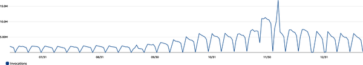

# PostNL and Taco Bell Serverless Journey and Design Modeling

# I. PostNL’s Serverless Journey

PostNL, a major logistics supplier in the Benelux with over 220 years of experience, transitioned to a 100% public cloud strategy by 2017. In 2019, to gain a competitive edge and lead the market, PostNL decided to build its own differentiating logistical software, with a "pronounced emphasis on serverless."

## Reasons for the Change Leading the Market through In-House Software

Prior to 2019, PostNL primarily relied on commercial off-the-shelf products and external vendors. This approach led to "non-differentiating solutions" that forced the company to "follow the market." The new strategy, articulated in their strategy deck, aimed to:

- "Develop differentiating capabilities faster, which we should understand ourselves."
- "Propose a viable capability to design, build, and operate digital platforms and systems in integrated teams for PostNL." This shift necessitated building their own software, departing from the vendor/supplier-based approach.

## The Serverless Journey Strategic and Mandatory Adoption

PostNL adopted a "fixed, flexible, free" model for technology decisions, with strategic choices categorized as "fixed." The decision to build applications with AWS cloud-native technology, specifically serverless, became "mandatory." Their AWS platform team (Cloud Center of Excellence, CCoE) even implemented "service control policies in place that make it impossible to spin up EC2 instances in our AWS accounts."

## Serverless Fit for Logistics Addressing Core Business Needs

Serverless was deemed a perfect fit for PostNL's highly seasonal and high-volume logistics business due to three core properties:

1. **Elastic Pricing:** The "pay per use" model (e.g., Lambda, EventBridge, SQS, Step Functions) ensures that "our systems hardly incur any cost during off-peak hours," making it significantly more cost-effective than statically provisioned capacity for fluctuating demand.

Typical usage pattern:

.png)

1. **Effortless Scaling:** Serverless services automatically scale with demand, regardless of predictability (e.g., Black Friday or COVID-19). This means "development teams do not need to think about capacity planning." An example shows Lambda invocations growing and peaking over six months "and nobody even noticed."
2. **Delegating the Hardest Problems to AWS:** PostNL operates at massive scales (millions of events daily, billions of IoT signals). Serverless allows them to "delegate the most difficult problems to AWS," such as capacity management, redundancy, networking, and maintenance. This means they don't need to consider physical CPUs, network scaling, or how to handle dynamic workloads. While this requires accepting "serverless’s inherent limits and opinionated design patterns," PostNL views these as beneficial "trade-offs" for "the most scalable, robust, and continually evolving services."

## Strong Foundations Greenfield AWS Organization and LPE

PostNL's journey involved three phases:

1. Working with external partners.
2. Building small-scale container-based solutions internally, revealing orchestration and maintenance overhead.
3. Choosing serverless as the preferred solution.

A critical step was designing a "greenfield AWS organization" with "funding and support from our established enterprise." This led to four guiding principles:

- "All provisioning is automated."
- "Every aspect of our applications is defined as code."
- "Operational burden is reduced to an absolute minimum."
- Supporting and training engineers.

The **Landing Zone PostNL Engineering (LPE)** platform codifies and enforces these principles, automating AWS account bootstrapping (within 30 minutes of approval) and maintaining guardrails. This includes SCPs prohibiting IAM user creation, use of unapproved Regions, manual changes to acceptance/production systems, and **denying all actions related to EC2 instances** (initially also RDS and Fargate, but relaxed for adoption).

## Freedom Within Guardrails Empowering Teams

PostNL compares its cloud environment to a "network of highways" where "basic rules are set across the entire organization, like the prohibition on the use of EC2 instances." Within these boundaries, teams have "the liberty to architect and build solutions the way they see fit," trusting them to make choices based on performance, development pace, and cost-effectiveness. This approach includes architectural reviews, cost/security monitoring, and domain architect support.

## Outcomes of Serverless Adoption

- **Scaled Core Business Processes:** From 0 in-house development teams in 2019 to over 30 teams building and maintaining 75+ applications.
- **Decreased Operational Incidents:** Due to a stable landing zone, strong guardrails, and delegating operational burden to AWS.
- **Reduced Overhead:** Financial and productivity gains from internal development teams better aligned with strategic goals.
- **Improved Talent Attraction:** The "serverless-only approach" helps dispel a "stuffy, boring image," attracting both young and experienced engineers interested in a company that "dares to change, embraces the future, and focuses on reducing operational burden."

## Pain Points and Learnings

- **Skill Set Gap:** Engineers often focus on single languages/stacks, requiring "unlearning" ingrained patterns. PostNL and AWS created a continuous learning and development program.
- **Retention:** Training engineers makes them "very valuable," increasing retention challenges, though the challenging tech stack also attracts new talent.
- **Dogmatic vs. Viable Approach:** Initial "pure serverless" restrictions (e.g., no relational databases or containers) hampered adoption. PostNL redefined "cloud native" to include "serverless and fully managed services like RDS and Fargate," while still blocking services requiring teams to manage compute instances (EC2, EKS).

## Advice to New Serverless Adopters

1. **Start from Guiding Principles:** Serverless is a tool, not the goal. Define business goals first (e.g., customer experience, market leadership, innovation, cost reduction) to inform technology choices.
2. **Embrace the Cloud for All It Has to Offer:** Full commitment to serverless yields the best results. "If your company is capable of embracing serverless, you will find that you can delegate entire classes of problems to AWS."
3. **Comprehensively Analyze Total Cost of Ownership (TCO):** Unit costs might seem higher, but significant savings come from reduced operational tasks (patching, provisioning, managing servers) and fewer incidents due to inherently scalable and distributed designs.
4. **Never Stop Learning:** The serverless landscape is vast and evolving. Maintain an open mind and continuously learn.

## II. Taco Bell’s Serverless Journey

Taco Bell, a quick service restaurant brand, began its digital transformation in 2018, leveraging serverless technology for key business domains like Menu Middleware, Order Middleware, and the migration of its legacy ecommerce system. Their dynamic environment requires continuous updates and handles significant order volume spikes.

## Before Serverless

- **Menu Middleware:** Faced challenges integrating menu data across 7,000+ restaurants, thousands of products, and hundreds of millions of pricing rules, with a tight deadline for major delivery provider integration.
- **Ecommerce (Tacobell.com and mobile apps):** The legacy system was a "Java-based monolith with a single database" facing typical problems:
- **Scaling Woes:** Manual, error-prone scaling for high-traffic events, leading to slowdowns and downtime.
- **Operational Costs:** Servers ran 24/7, and oversized databases for unpredictable traffic.
- **Slow Innovation:** Slow build processes, complex/brittle code (over a million lines), and few specialists understanding it.
- **Single Points of Failure:** Database or job server issues could cause system-wide outages.
- **Onboarding/Development:** Weeks/months to set up new developers or environments.

The decision to migrate the ecommerce monolith to a modern microservices platform was driven by the desire for "flexibility, the scalability, and the other numerous benefits." Taco Bell wanted to be "scrappy, much like a start-up" and "leverage strategic vendors like AWS as much as possible."

## The Serverless Journey "Scrappy" and "Serverless-First"

Initial attempts with traditional serverful approaches in AWS were "very complex," requiring extensive DevOps effort before any business value could be delivered. Frustration with VPC and security group settings led them to explore serverless.

Robbie Kohler, Sr. Director of Software Engineering, initially admitted, "I didn’t understand the concept at first. There had to be servers somewhere, right?" However, the potential became clear: "they wanted to spend the least number of resources possible and still deliver meaningful business value."

The strategy started conservatively, "dipping its toes into serverless for a few specific workloads." A "grassroots movement" of serverless adoption led to the formation of a "serverless community of practice," and Taco Bell officially became a "serverless-first" tech organization.

## Serverless Architecture Examples

.png)

- **Menu Middleware (Hybrid to Fully Serverless):** Started with traditional RDS MySQL and ETL tools but successfully ported menu ingestion to a monolithic .NET Lambda function, which scaled effectively. The system evolved to be fully serverless over several years, supporting 12+ integration channels and tens of thousands of menus daily.

    .png)

## Order Middleware

.png)

- 100% serverless
- Serverless Framework for IaC
- Secrets Manager for secrets
- Middy Middleware and Lambda Powertools for TypeScript for cross-cutting concerns such as secrets/parameter caching, JSON structured logging
- Lumigo and CloudWatch for observability
- Step Functions for orchestration and EventBridge for choreographing events:
  - Express Step Functions workflows are nested in standard workflows for processing short, synchronous flows.
  - When a driver is close to the store, an event is sent to EventBridge so that the order can be released (using the callback task token pattern in Step Functions, discussed in “Distributed Orchestration” in Chapter 5) and the food can be made.
- Express Step Functions workflows are nested in standard workflows for processing short, synchronous flows.
- When a driver is close to the store, an event is sent to EventBridge so that the order can be released (using the callback task token pattern in Step Functions, discussed in “Distributed Orchestration” in Chapter 5) and the food can be made.
- DynamoDB for order info and task token persistence
- Caching with content delivery network (CDN) and Lambda function memory
- Lambda functions written in TypeScript for compute, using a simplified hexagonal pattern (see Chapter 3):
  - **Core domain logic is encapsulated for easy unit testing.**
  - **Port/adapter logic is built into the Lambda functions.**
  - **Integration testing is done in live AWS environments.**
- Core domain logic is encapsulated for easy unit testing.
- Port/adapter logic is built into the Lambda functions.
- Integration testing is done in live AWS environments.

# The Outcome of Serverless Adoption

Here’s a recap of the outcome of the serverless adoption project for each service:

***Menu Middleware***
• Able to meet the deadline in mid-2018 to integrate with the major delivery provider due to serverless adoption. The team consisted of only two engineers.
• As of November 2023, the system had scaled to support over 12 different integration channels, integrating tens of thousands of menus a day in real time.
• The team started out with a hybrid model of serverful and serverless components. Once they saw success with serverless, the system was completely migrated to serverless over the course of several years.

***Order Middleware***
• Within two months of starting the project it was live in production, integrating customer orders directly from the delivery marketplace to the POS. In the coming months, three more delivery providers were integrated into the Order Middleware platform.
• The system is capable of processing millions of orders per day without scaling issues.
• The system is cost-effective and predictable in cost forecasting, as it’s easy to calculate the total cost per order (something that would have been near-impossible to do accurately using a serverful approach).

***Ecommerce migration***
• In less than a year, a small team of five engineers migrated the entire backend to the serverless architecture without impacting existing operations.
• The team saw a 95% decrease in lines of code, from roughly one million lines of source and configuration code in the monolith to less than 50K lines in serverless.
• The team saw a 90%+ reduction in AWS costs going from serverful to serverless.
• Post-migration, releases to production occur multiple times per week; before, they averaged around once a month.
• The team can get a new developer productive on a serverless service in less than one hour. With the previous system, this would have taken multiple weeks or even months.
• The new event-driven approach allows new services to be added seamlessly without impacting existing code.
• High-traffic promotional campaigns are handled effortlessly with the serverless architecture, with no preparation needed.

## Development Process and Team Structure

- Agile/Scrum with two-week sprints and "two-pizza teams" (cross-functional and multiplatform).
- Testing includes unit tests, integration tests against live AWS services, and performance/load tests.

Cloud platform engineering team:

- Works on standardizing cross-cutting concerns for developers
- Builds shared libraries (logging, caching)
- Ensures security best practices are being addressed and are built into new solutions

Audits existing serverless services and provides suggestions and feedback

- Deployment frequency is high (multiple times per week for some teams).
- Separate AWS accounts for non-production (single per domain/team) and production (separate per domain/team).

## Pain Points and Learnings

- **Monolithic Functions:** Early mistake was creating large Lambda functions doing too much. They learned to apply the "single-responsibility principle" for smaller, focused functions and to use Step Functions for orchestration.
- **Understanding Concurrency:** Learned "the hard way" about Lambda concurrency and reserved concurrency to avoid throttling or hitting account limits, also emphasizing appropriate timeouts.

## Advice to New Serverless Adopters

1. **Embrace an Iterative Mindset of “Good Enough”:** Release features when "good enough" to limit FUD and gain momentum. Serverless enables quick iteration and faster results. The Cloud Platform Engineering team helps by providing best practice templates.
2. **Avoid Big Bang Migrations:** Taco Bell successfully migrated their ecommerce monolith using a "strangler fig pattern with vertical slices" (store, menu, cart/order, user microservices). This de-risked the project, allowed testing with small numbers of stores, and provided emergency feature flags for rollback.
3. **Favor Simplicity:** In architecture and code, prioritize explicit and straightforward solutions over clever ones. The "You Aren’t Gonna Need It" (YAGNI) principle applies, keeping abstractions light.
4. **Go Serverless-First!** While starting conservatively is fine, "once you are serious about it, you should fully commit." This focus reduces cognitive load and accelerates development. Being "serverless-first does not necessarily mean you are serverless-only" – serverful components can be used for rare, specific workloads where serverless doesn't fit (e.g., high volume, stateful long-running jobs).

## III. General Themes and Best Practices for Serverless Adoption

Both PostNL and Taco Bell's experiences highlight several common themes and offer valuable advice for enterprises considering or implementing serverless strategies:

- **Strategic Imperative:** Serverless adoption should be driven by clear business goals, such as competitive differentiation, innovation, faster time to market, and operational cost reduction, rather than technology for technology's sake.
- **Commitment and "Serverless-First" Mindset:** While iterative adoption is acceptable initially, full commitment to serverless yields the greatest benefits. This involves a bias towards serverless solutions by default, delegating significant operational burden to the cloud provider.
- **Total Cost of Ownership (TCO):** Companies must look beyond unit pricing to consider the overall savings from reduced operational overhead (human labor for infrastructure management) and fewer incidents.
- **Building Strong Foundations/Platforms:** A dedicated platform team (like PostNL's CCoE or Taco Bell's Cloud Platform Engineering team) is crucial for:
- Automating provisioning and account bootstrapping.
- Enforcing guardrails and governance (e.g., SCPs to block serverful services).
- Standardizing tools, services, and best practices (e.g., IaC, observability).
- Providing templates and shared libraries.
- **Freedom Within Guardrails:** Empowering development teams to make architectural choices within defined boundaries promotes innovation and ownership. Blocking certain high-overhead services (like EC2) by default, while allowing flexibility with managed services, is a common approach.
- **Skill Set Development:** Serverless requires new skills and "unlearning" old patterns. Continuous learning and development programs are essential for engineers.
- **Iterative Migrations:** For legacy systems, employing patterns like the "strangler fig" and breaking down migrations into small, vertical slices significantly de-risks the transition.
- **Simplicity and Single Responsibility:** Favor smaller, focused functions and use orchestration services (like Step Functions) for complex workflows. Prioritize explicit and straightforward code over clever abstractions.
- **Observability and Monitoring:** Crucial for understanding system behavior in a distributed, serverless environment.

## IV. Solution Design and Threat Modeling Best Practices

The appendices provide structured approaches for critical documentation in serverless development:

## Solution Design Document

A comprehensive document to visualize and plan solutions before building, typically including:

- **Overview:** Brief outline of purpose and problem.
- **Revision History:** Log of document changes.
- **Requirements:** Detailed context from business and technical stakeholders.
- **Logical Design:** High-level, non-technical perspective for all audiences (using flowcharts, C4 models).
- **Architecture:** Technical diagrams using cloud service icons.
- **Design Details:** In-depth technical specifics, adhering to AWS Well-Architected Framework principles.
- **Data Modeling:** Detailed plans for data storage (RDBMS, NoSQL, object stores), including access patterns, keys, indexes, and scaling.
- **Cost Estimation:** Analysis of proposed architecture's cost, focusing on awareness and blind spots.
- **Sustainability Measures:** Discussion and recording of environmentally conscious design choices.
- **Observability and Monitoring:** Planning for structured logging, dashboards, and alarms.
- **Trade-offs:** Documentation of design decisions and justifications.

## Security and Threat Modeling Template (STRIDE Methodology)

A process to identify, enumerate, and prioritize potential threats and mitigations, following the STRIDE methodology (Spoofing, Tampering, Repudiation, Information Disclosure, Denial of Service, Elevation of Privilege). Key sections include:

- **Description:** Context of the application.
- **Architecture & Data Flow Diagram (DFD):** Visualizing information flow and trust zones.
- **Assets:** Identifying valuable items to protect.
- **Attackers:** Categorizing potential threats (external, internal).
- **Exclusions:** Items outside the threat model's scope.
- **Requirements:** Business, industry, technology, regulatory, and privacy requirements informing threat identification.
- **Threats:** Detailed identification, risk assessment, remediation, and action plans for each threat.
- **Actions:** Tracking tickets for remediation steps.
- **Residual Risks:** Documenting risks remaining after practical preventive measures.

## Failure Modes and Effects Analysis (FMEA) Worksheet

A systematic process to review software components for potential failures, their causes, and effects, allowing for risk prioritization. The worksheet includes columns for:

- **Component:** Part of the system that could fail.
- **Failure Mode:** Description of the potential failure.
- **Cause(s):** Root causes.
- **Effect(s):** Impact on the application.
- **Probability:** Likelihood of occurrence (1: extremely unlikely to 5: frequent).
- **Severity:** Impact if failure occurs (1: no effect to 5: complete failure).
- **Detection:** Likelihood of pre-deployment detection (1: certain to 5: undetectable).
- **Risk:** Calculated as (Probability * Severity) + Detection.

This structured approach helps identify and prioritize remedial steps, such as automated recovery, tests, or metric alarms.
